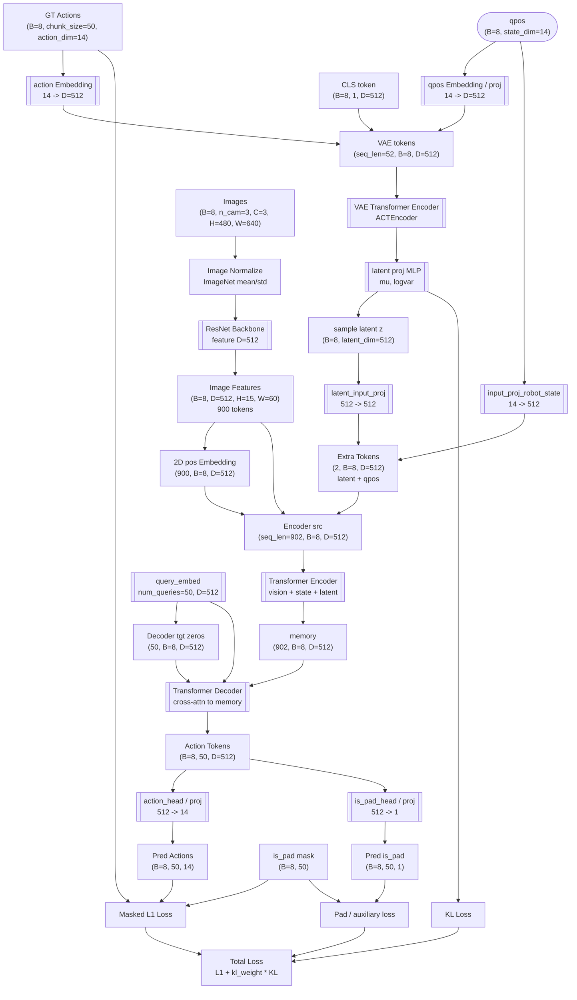

(RoboTwin 2.0 03a1a55 & lerobot)
```python
[class ACTPolicy(nn.Module).__call__(self, qpos, image, actions=None, is_pad=None)]
- qpos: 8, 14
- image: 8, 3, 3, 480, 640 # the first 3 means camera num
- actions: 8, 125, 14 # wtf is 125?

env_state = None
normalize = transforms.Normalize(mean=[0.485, 0.456, 0.406], std=[0.229, 0.224, 0.225])
```

## 这里整个 act 类型叫做 DETRVAE:
```python
model = DETRVAE(
    backbones,
    transformer,
    encoder,
    state_dim=state_dim,
    num_queries=args.chunk_size,  #gyh
    camera_names=args.camera_names,
)
```

## General

```
                       Transformer
                       推理时不适用 VAE.
                       (acts as VAE decoder
                        during training)
                      ┌───────────────────────┐
                      │             Outputs   │
                      │                ▲      │
                      │     ┌─K───►┌───────┐  │
     ┌──────┐         │     │      │Transf.│  │
     │      │         │     ├─V───►│decoder│  │
┌────┴────┐ │         │     │      │       │  │
│         │ │         │ ┌───┴───┬─►│       │  │
│ VAE     │ │         │ │       │  └───────┘  │
│ encoder │ │         │ │Transf.│             │
│         │ │         │ │encoder│             │
└───▲─────┘ latent    │ │       │             │
    │   (sample during│ └▲──▲─▲─┘             │
    │    inference)   │  │  │ │               │
  inputs    └─────────┼──┘  │ image emb.(use resnet backbone)
    │                 │   qpos emb.(No action emb.)
action&qpos emb.      └───────────────────────┘


latent: (b, 512)
```

这个 ACTEncoder 和 Transf. encoder 是同一个类型 (TransformerEncoder) 的两个实例. 但是输入形状不同.

- VAE Encoder:
```python
encoder_input.shape
torch.Size([52, 8, 512])
<=
cls_embed.shape
torch.Size([8, 1, 512])

qpos_embed.shape
torch.Size([8, 1, 512])

action_embed.shape
torch.Size([8, 50, 512])
```

- 图中 Transf:
```python
features[0].shape
torch.Size([8, 512, 15, 20]) # 图像原尺寸 480*640，这边15x20就是resnet下采样
三个摄像头就是 [15, 60]

Encoder:
pos_embed.shape
torch.Size([902, 8, 512])

addition_input.shape
torch.Size([2, 8, 512])

src.shape # 15x60=900 个图像编码 + 1*latent + 1*qpos，都是 512 维，各自还有一个 512 维的 pos emb
torch.Size([902, 8, 512])
=>

 TransformerEncoder 输入输出流程

 输入源信息:
 ┌─────────────────────────────────────────────────────────────────┐
 │ 相机图像特征: [B, C, H, W] → 展平 → [H×W, B, hidden_dim]      │
 │ 机器人状态:   [B, state_dim] → 投影 → [1, B, hidden_dim]      │
 │ 潜在变量:     [B, latent_dim] → 投影 → [1, B, hidden_dim]     │
 │ 位置编码:     对应每个token的空间/序列位置信息                 │
 └─────────────────────────────────────────────────────────────────┘
                               ↓
 ┌─────────────────────────────────────────────────────────────────┐
 │                    TransformerEncoder                          │
 │                                                                 │
 │  输入: [seq_len, B, hidden_dim]  (seq_len = 2 + H×W)          │
 │  其中:                                                          │
 │  - seq_len: 序列长度 (潜在变量1 + 机器人状态1 + 图像特征H×W)    │
 │  - B: batch size                                               │
 │  - hidden_dim: 通常是 256                                      │
 │                                                                 │
 │  ↓ 经过 N 个 TransformerEncoderLayer                           │
 │                                                                 │
 │  每个 EncoderLayer 包含:                                        │
 │  ┌─────────────────────────────────────────────────────────┐   │
 │  │ 1. 多头自注意力: 提取序列内部关系                          │   │
 │  │    Input: [seq_len, B, hidden_dim]                      │   │
 │  │    Output: [seq_len, B, hidden_dim]                     │   │
 │  │                                                         │   │
 │  │ 2. 前馈网络: 非线性变换                                  │   │
 │  │    Linear1: hidden_dim → dim_feedforward (2048)        │   │
 │  │    Activation → Dropout → Linear2: 2048 → hidden_dim   │   │
 │  │                                                         │   │
 │  │ 3. 残差连接 + LayerNorm: 稳定训练                        │   │
 │  └─────────────────────────────────────────────────────────┘   │
 │                                                                 │
 │  输出: [seq_len, B, hidden_dim]  (与输入相同形状)             │
 └─────────────────────────────────────────────────────────────────┘
                               ↓
 输出到 TransformerDecoder:
 ┌─────────────────────────────────────────────────────────────────┐
 │ memory: [seq_len, B, hidden_dim]                              │
 │ 作为 decoder 交叉注意力的 key 和 value                        │
 │ 为动作生成提供完整的上下文信息                                 │
 └─────────────────────────────────────────────────────────────────┘

=>

 TransformerDecoder 输入输出流程

 输入源信息:
 ┌─────────────────────────────────────────────────────────────────┐
 │ 查询序列:     tgt = zeros_like(query_embed)                    │
 │              形状: [num_queries, B, hidden_dim]              │
 │              作用: 动作生成的"模板" (全零初始化)              │
 │                                                                 │
 │ 查询嵌入:     query_embed = nn.Embedding(num_queries, hidden_dim) │
 │              形状: [num_queries, hidden_dim]                 │
 │              作用: 可学习的动作步特定表示                     │
 │                                                                 │
 │ 记忆信息:     memory (来自 encoder)                            │
 │              形状: [seq_len, B, hidden_dim]                  │
 │              作用: 编码的状态信息 (视觉+状态+潜在变量)        │
 │                                                                 │
 │ 位置编码:     pos (对应 memory)                               │
 │              形状: [seq_len, B, hidden_dim]                  │
 │              作用: 为记忆提供位置信息                        │
 └─────────────────────────────────────────────────────────────────┘
                               ↓
 ┌────────────────────────────────────────────────────────────────┐
 │                    TransformerDecoder                          │
 │                                                                │
 │  输入:                                                         │
 │  - tgt:        [num_queries, B, hidden_dim]  (动作查询)        │
 │  - memory:     [seq_len, B, hidden_dim]  状态记忆from Encoder  │
 │  - query_pos:  [num_queries, B, hidden_dim]  (查询位置)        │
 │  - pos:        [seq_len, B, hidden_dim]     (记忆位置)         │
 │                                                                │
 │  ↓ 经过 N 个 TransformerDecoderLayer                           │
 │                                                                │
 │  每个 DecoderLayer 包含双重注意力:                             │
 │  ┌─────────────────────────────────────────────────────────┐   │
 │  │ 1. 自注意力 (Self-Attention):                           │   │
 │  │    Query: 查询序列 + 查询位置编码                       │   │
 │  │    Key:   查询序列 + 查询位置编码                       │   │
 │  │    Value: 查询序列                                      │   │
 │  │    作用: 动作步之间的相互关系                           │   │
 │  │                                                         │   │
 │  │ 2. 交叉注意力 (Cross-Attention):                        │   │
 │  │    Query: 查询序列 + 查询位置编码                       │   │
 │  │    Key:   记忆序列 + 记忆位置编码                       │   │
 │  │    Value: 记忆序列 (状态信息)                           │   │
 │  │    作用: 从状态记忆中提取相关信息                       │   │
 │  │                                                         │   │
 │  │ 3. 前馈网络: 非线性变换                                 │   │
 │  │    Linear1: hidden_dim → dim_feedforward (2048)         │   │
 │  │    Activation → Dropout → Linear2: 2048 → hidden_dim    │   │
 │  └─────────────────────────────────────────────────────────┘   │
 │                                                                │
 │  输出: [num_queries, B, hidden_dim]  (动作特征表示)            │
 └────────────────────────────────────────────────────────────────┘
                               ↓
 输出到动作头:
 ┌─────────────────────────────────────────────────────────────────┐
 │ a_hat = self.action_head(hs)  (Linear)                          │
 │ 形状: [B, num_queries, action_dim]                              │
 │ 作用: 将动作特征映射到具体关节角度                              │
 │                                                                 │
 │ is_pad_hat = self.is_pad_head(hs) (Linear)                      │
 │ 形状: [B, num_queries, 1]                                       │
 │ 作用: 预测哪些动作步是填充位                                    │
 └─────────────────────────────────────────────────────────────────┘
```

```python
query_embed.shape
torch.Size([50, 8, 512])
[?] why length is 50? why use nn.Embedding, 而不是自注意力？
- 固定查询位置： query_embed 是固定长度 (`num_queries`) 的学习参数，代表 `num_queries`
      个“查询槽位”，每个槽位询问一个动作。
```

## 杂项
is_pad?
- 应该就是考虑到有些采样动作长度不足 chunk_size，其对应位置 is_pad 为 true 且 input 由复制产生且不会被注意（已验证）

