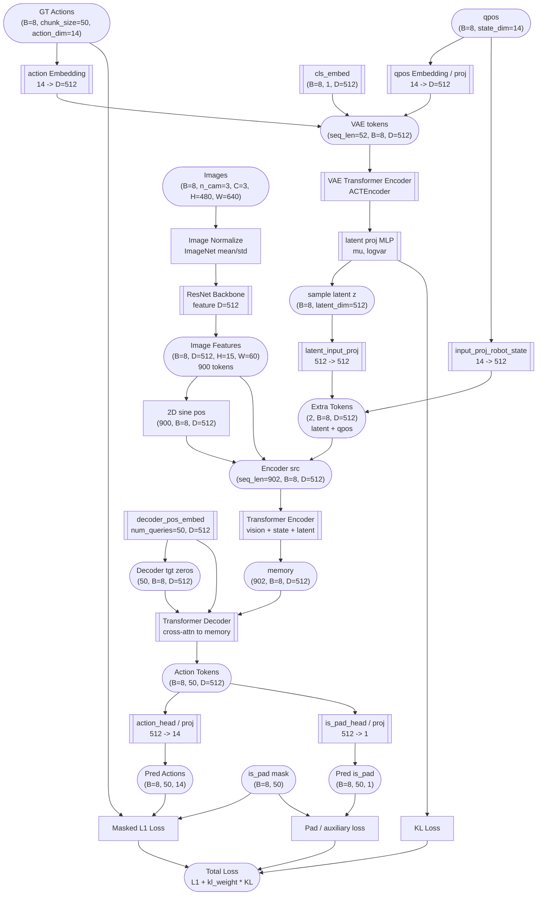
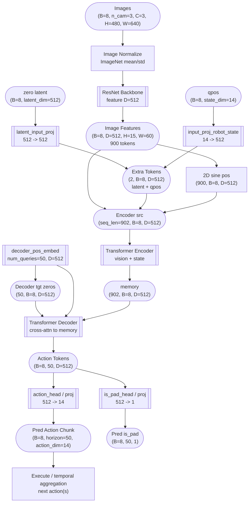
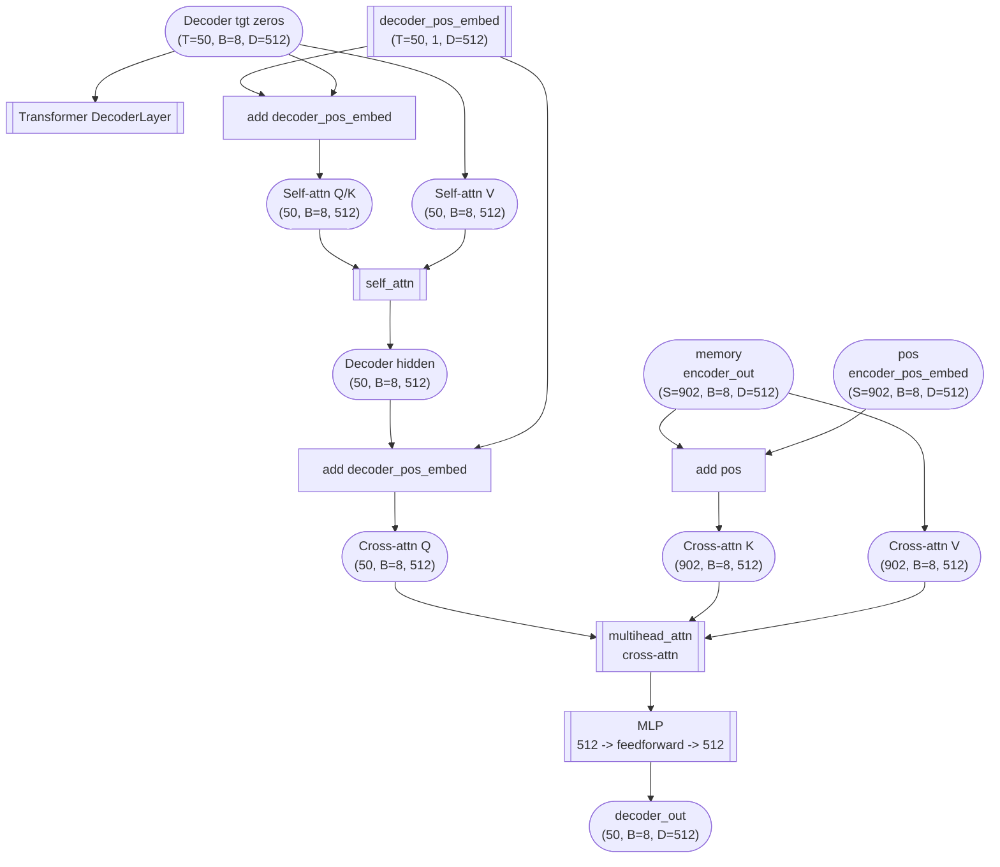

(RoboTwin 2.0 03a1a55 & lerobot)
```python
[class ACTPolicy(nn.Module).__call__(self, qpos, image, actions=None, is_pad=None)]
- qpos: 8, 14
- image: 8, 3, 3, 480, 640 # the first 3 means camera num
- actions: 8, 125, 14 # wtf is 125?
```

## 这里整个 act 类型叫做 DETRVAE:
```python
model = DETRVAE(
    backbones,
    transformer,
    encoder,
    state_dim=state_dim,
    num_queries=args.chunk_size,
    camera_names=args.camera_names,
)
```

## General

```
                       Transformer
                       推理时不适用 VAE.
                       (acts as VAE decoder
                        during training)
                      ┌───────────────────────┐
                      │             Outputs   │
                      │                ▲      │
                      │     ┌─K───►┌───────┐  │
     ┌──────┐         │     │      │Transf.│  │
     │      │         │     ├─V───►│decoder│  │
┌────┴────┐ │         │     │      │       │  │
│         │ │         │ ┌───┴───┬─►│       │  │
│ VAE     │ │         │ │       │  └───────┘  │
│ encoder │ │         │ │Transf.│             │
│         │ │         │ │encoder│             │
└───▲─────┘ latent    │ │       │             │
    │   (sample during│ └▲──▲─▲─┘             │
    │    inference)   │  │  │ │               │
  inputs    └─────────┼──┘  │ image emb.(use resnet backbone)
    │                 │   qpos emb.(No action emb.)
action&qpos emb.      └───────────────────────┘

where latent: (b, 512)
```

## 其他
- is_pad 是什么：考虑到有些采样动作长度不足 chunk_size，其对应位置 is_pad 为 true 且 input 由复制产生且不会被注意（已验证）
- decoder_pos_embed 是什么：形状是 [50, 8, 512], 是固定长度 (`num_queries`) 的学习参数，代表 `num_queries`个“查询槽位”，每个槽位询问一个动作。

## Train


## Infer


## 其中 decoder QKV
