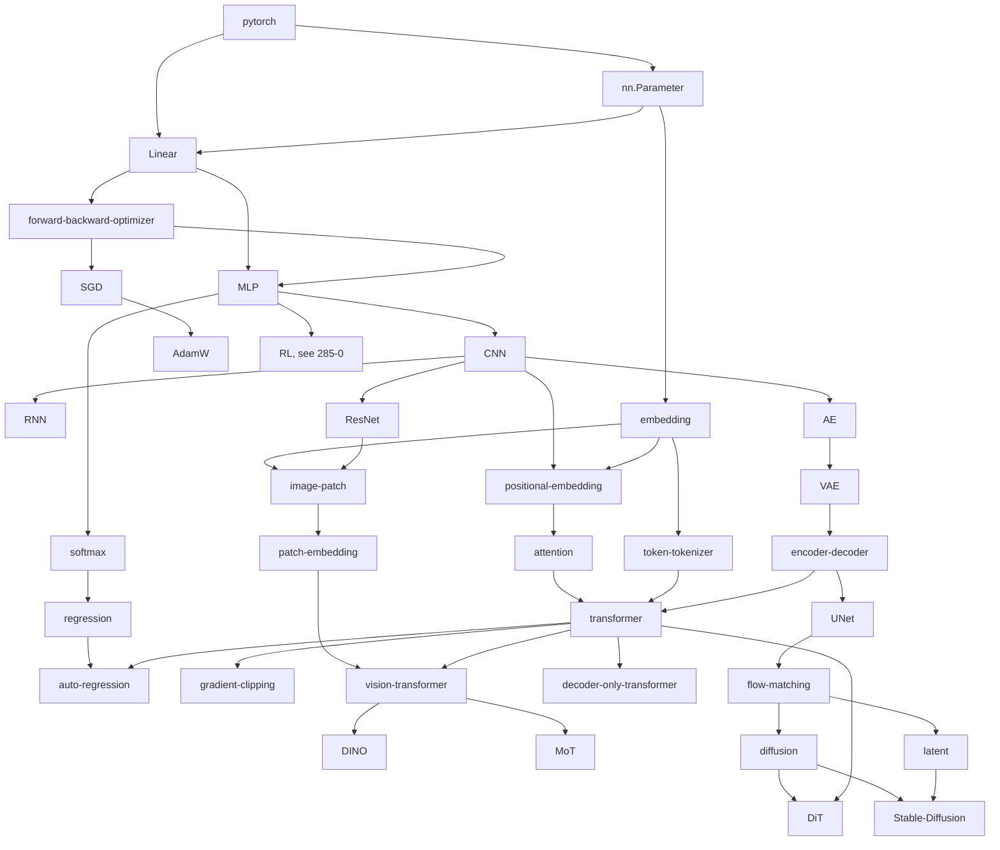
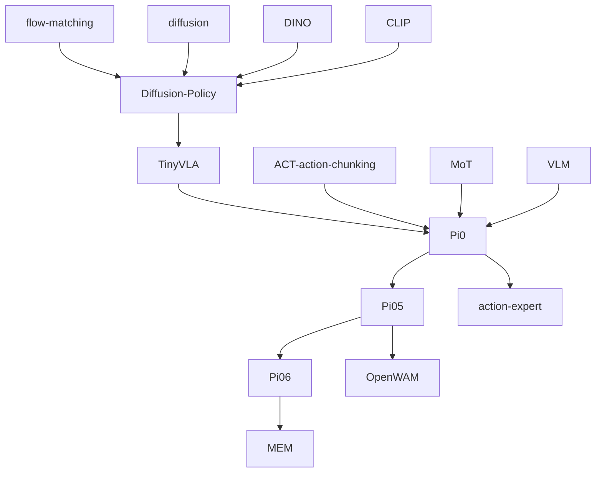
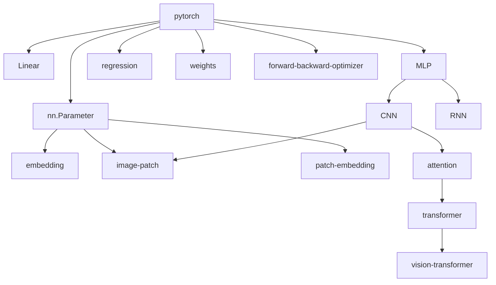

### Deep learning

```mermaid
flowchart TD
  pytorch --> Linear --> MLP --> CNN --> RNN
  MLP --> softmax --> regression --> auto-regression
  Linear --> forward-backward-optimizer --> MLP & SGD
  SGD --> AdamW
  MLP --> RL[RL, see 285-0]
  transformer --> gradient-clipping
  nn.Parameter --> embedding --> image-patch
  CNN --> ResNet --> image-patch --> patch-embedding --> vision-transformer
  pytorch --> nn.Parameter --> Linear
  CNN & embedding --> positional-embedding --> attention --> transformer --> vision-transformer --> DINO & MoT
  embedding --> token-tokenizer --> transformer --> decoder-only-transformer
  encoder-decoder --> transformer
  transformer --> auto-regression
  diffusion & transformer --> DiT
  CNN --> AE --> VAE --> encoder-decoder --> UNet --> flow-matching --> diffusion
  flow-matching --> latent
  diffusion & latent --> Stable-Diffusion
```

### Robot Policy Beginnner

```mermaid
flowchart TD
    flow-matching & diffusion & DINO & CLIP --> Diffusion-Policy --> TinyVLA --> Pi0 --> Pi05 --> Pi06 --> MEM
    Pi0 --> action-expert
    ACT-action-chunking & MoT & VLM --> Pi0
    Pi05 --> OpenWAM
```

try:

```mermaid
flowchart TD
    %% level 0
    pytorch
    %% level 1
    pytorch --> Linear & MLP & regression & nn.Parameter & weights & forward-backward-optimizer
    %% level 2
    MLP --> CNN & RNN
    %% level 3
    nn.Parameter --> embedding & image-patch & patch-embedding
    CNN --> image-patch
    %% level 4
    CNN --> attention
    transformer
    %% level 5
    attention --> transformer --> vision-transformer
```
