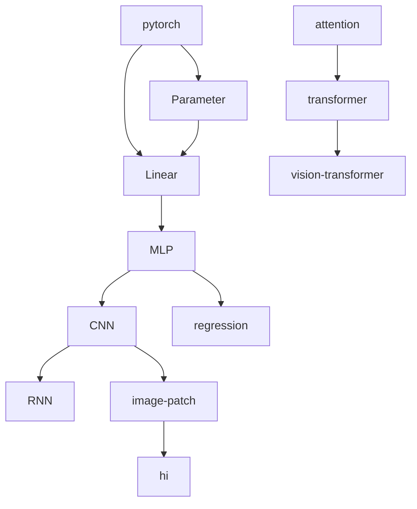

```mermaid
flowchart TD
  pytorch --> Linear --> MLP --> CNN --> RNN
  MLP --> regression
  CNN --> image-patch --> hi
  pytorch --> Parameter --> Linear
  attention --> transformer --> vision-transformer
```
