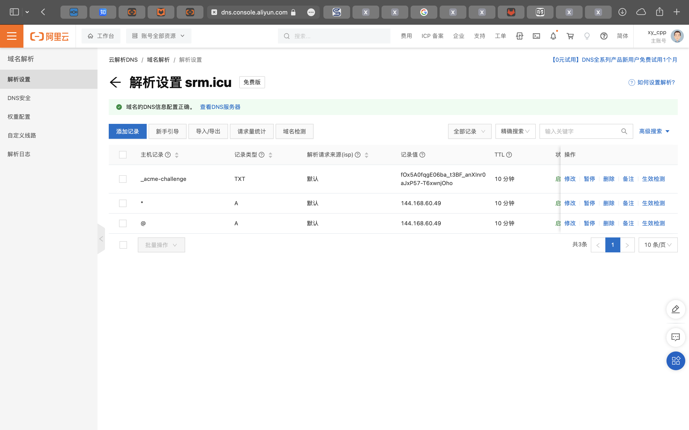

## #source xy_cpp

在服务商那边加入一个通配符，如



> xy_cpp: 第一个不用管

然后参考以下文件：

```
❯ cat /etc/nginx/sites-enabled/srm.icu
server {
    server_name srm.icu git.srm.icu cloud.srm.icu;
    location / {
        proxy_pass http://127.0.0.1:8081;
        proxy_set_header Host $host;
        proxy_set_header X-Real-IP $remote_addr;
        proxy_set_header X-Forwarded-For $proxy_add_x_forwarded_for;
    }
    listen 443 ssl; # managed by Certbot
    ssl_certificate /etc/letsencrypt/live/srm.icu/fullchain.pem; # managed by Certbot
    ssl_certificate_key /etc/letsencrypt/live/srm.icu/privkey.pem; # managed by Certbot
    include /etc/letsencrypt/options-ssl-nginx.conf; # managed by Certbot
    ssl_dhparam /etc/letsencrypt/ssl-dhparams.pem; # managed by Certbot
}

server {
    if ($host = cloud.srm.icu) {
        return 301 https://$host$request_uri;
    } # managed by Certbot

    if ($host = git.srm.icu) {
        return 301 https://$host$request_uri;
    } # managed by Certbot


    if ($host = srm.icu) {
        return 301 https://$host$request_uri;
    } # managed by Certbot

    server_name srm.icu git.srm.icu cloud.srm.icu ;
    listen 80;
    return 404; # managed by Certbot
}
```

> xy_cpp: 这个没有证书的话删掉ssl的相关配置
> 哦你不同域名跑不同东西就分开来写
> 我那个是全部转发到8001，然后8001转发到内网穿透
> 内网再做一次判断的

