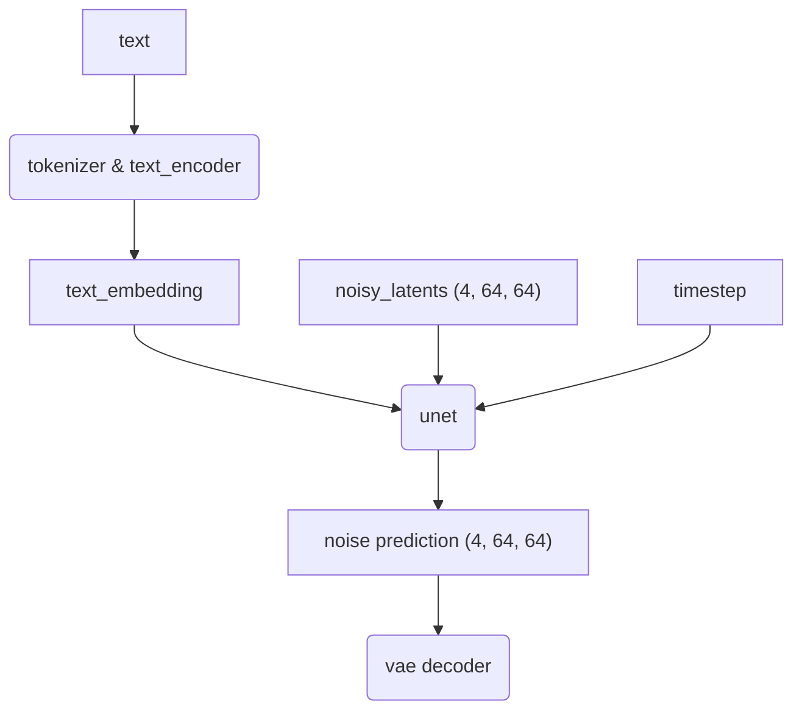

## Stable Diffusion Pipeline 的职责是?

说白了 unet 预测的就是 vae 的 latent.

pipe:
- unet
- vae
- text_encoder
- image_encoder
- feature_extractor
- tokenizer (is a nn.Module without params)
- scheduler
- safety_checker ?

