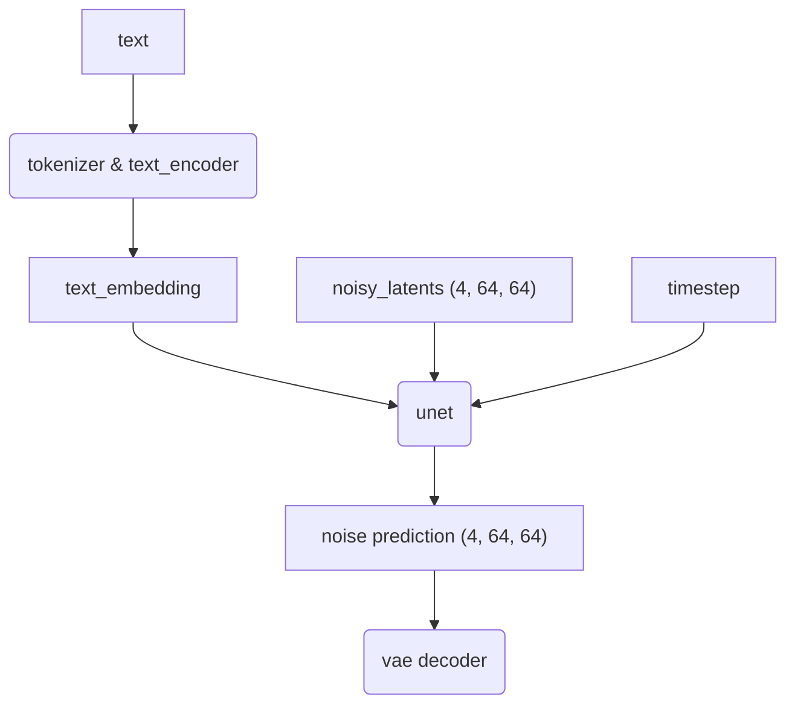

<<<<<<< Updated upstream
<<<<<<< Updated upstream
<<<<<<< Updated upstream
<<<<<<< Updated upstream
<<<<<<< Updated upstream
<<<<<<< Updated upstream
<<<<<<< Updated upstream
<<<<<<< Updated upstream
<<<<<<< Updated upstream
<<<<<<< Updated upstream
<<<<<<< Updated upstream
<<<<<<< Updated upstream
<<<<<<< Updated upstream
<<<<<<< Updated upstream
<<<<<<< Updated upstream
<<<<<<< Updated upstream
<<<<<<< Updated upstream
<<<<<<< Updated upstream
<<<<<<< Updated upstream
<<<<<<< Updated upstream
<<<<<<< Updated upstream
<<<<<<< Updated upstream
<<<<<<< Updated upstream
<<<<<<< Updated upstream
<<<<<<< Updated upstream
<<<<<<< Updated upstream
<<<<<<< Updated upstream
<<<<<<< Updated upstream
<<<<<<< Updated upstream
<<<<<<< Updated upstream
<<<<<<< Updated upstream
<<<<<<< Updated upstream
<<<<<<< Updated upstream
<<<<<<< Updated upstream
<<<<<<< Updated upstream
<<<<<<< Updated upstream
<<<<<<< Updated upstream
<<<<<<< Updated upstream
<<<<<<< Updated upstream
<<<<<<< Updated upstream
<<<<<<< Updated upstream
<<<<<<< Updated upstream
<<<<<<< Updated upstream
<<<<<<< Updated upstream
<<<<<<< Updated upstream
<<<<<<< Updated upstream
<<<<<<< Updated upstream
<<<<<<< Updated upstream
<<<<<<< Updated upstream
<<<<<<< Updated upstream
<<<<<<< Updated upstream
<<<<<<< Updated upstream
<<<<<<< Updated upstream
<<<<<<< Updated upstream
<<<<<<< Updated upstream
<<<<<<< Updated upstream
<<<<<<< Updated upstream
<<<<<<< Updated upstream
<<<<<<< Updated upstream
<<<<<<< Updated upstream
<<<<<<< Updated upstream
<<<<<<< Updated upstream
<<<<<<< Updated upstream
<<<<<<< Updated upstream
<<<<<<< Updated upstream
<<<<<<< Updated upstream
<<<<<<< Updated upstream
<<<<<<< Updated upstream
<<<<<<< Updated upstream
<<<<<<< Updated upstream
<<<<<<< Updated upstream
<<<<<<< Updated upstream
<<<<<<< Updated upstream
<<<<<<< Updated upstream
<<<<<<< Updated upstream
<<<<<<< Updated upstream
<<<<<<< Updated upstream
<<<<<<< Updated upstream
<<<<<<< Updated upstream
<<<<<<< Updated upstream
<<<<<<< Updated upstream
<<<<<<< Updated upstream
<<<<<<< Updated upstream
<<<<<<< Updated upstream
<<<<<<< Updated upstream
<<<<<<< Updated upstream
<<<<<<< Updated upstream
<<<<<<< Updated upstream
<<<<<<< Updated upstream
<<<<<<< Updated upstream
<<<<<<< Updated upstream
<<<<<<< Updated upstream
<<<<<<< Updated upstream
<<<<<<< Updated upstream
<<<<<<< Updated upstream
<<<<<<< Updated upstream
<<<<<<< Updated upstream
<<<<<<< Updated upstream
<<<<<<< Updated upstream
<<<<<<< Updated upstream
<<<<<<< Updated upstream
<<<<<<< Updated upstream
<<<<<<< Updated upstream
<<<<<<< Updated upstream
<<<<<<< Updated upstream
<<<<<<< Updated upstream
<<<<<<< Updated upstream
<<<<<<< Updated upstream
<<<<<<< Updated upstream
<<<<<<< Updated upstream
<<<<<<< Updated upstream
<<<<<<< Updated upstream
<<<<<<< Updated upstream
<<<<<<< Updated upstream
<<<<<<< Updated upstream
<<<<<<< Updated upstream
<<<<<<< Updated upstream
<<<<<<< Updated upstream
<<<<<<< Updated upstream
<<<<<<< Updated upstream
<<<<<<< Updated upstream
<<<<<<< Updated upstream
<<<<<<< Updated upstream
<<<<<<< Updated upstream
<<<<<<< Updated upstream
<<<<<<< Updated upstream
<<<<<<< Updated upstream
<<<<<<< Updated upstream
<<<<<<< Updated upstream
<<<<<<< Updated upstream
<<<<<<< Updated upstream
<<<<<<< Updated upstream
<<<<<<< Updated upstream
<<<<<<< Updated upstream
<<<<<<< Updated upstream
<<<<<<< Updated upstream
<<<<<<< Updated upstream
<<<<<<< Updated upstream
<<<<<<< Updated upstream
<<<<<<< Updated upstream
<<<<<<< Updated upstream
<<<<<<< Updated upstream
<<<<<<< Updated upstream
<<<<<<< Updated upstream
<<<<<<< Updated upstream
<<<<<<< Updated upstream
<<<<<<< Updated upstream

## Stable Diffusion Pipeline 的职责是?

说白了 unet 预测的就是 vae 的 latent.
=======
## Stable Diffusion Pipeline 的职责是?
>>>>>>> Stashed changes
=======
## Stable Diffusion Pipeline 的职责是?
>>>>>>> Stashed changes
=======
## Stable Diffusion Pipeline 的职责是?
>>>>>>> Stashed changes
=======
## Stable Diffusion Pipeline 的职责是?
>>>>>>> Stashed changes
=======
## Stable Diffusion Pipeline 的职责是?
>>>>>>> Stashed changes
=======
## Stable Diffusion Pipeline 的职责是?
>>>>>>> Stashed changes
=======
## Stable Diffusion Pipeline 的职责是?
>>>>>>> Stashed changes
=======
## Stable Diffusion Pipeline 的职责是?
>>>>>>> Stashed changes
=======
## Stable Diffusion Pipeline 的职责是?
>>>>>>> Stashed changes
=======
## Stable Diffusion Pipeline 的职责是?
>>>>>>> Stashed changes
=======
## Stable Diffusion Pipeline 的职责是?
>>>>>>> Stashed changes
=======
## Stable Diffusion Pipeline 的职责是?
>>>>>>> Stashed changes
=======
## Stable Diffusion Pipeline 的职责是?
>>>>>>> Stashed changes
=======
## Stable Diffusion Pipeline 的职责是?
>>>>>>> Stashed changes
=======
## Stable Diffusion Pipeline 的职责是?
>>>>>>> Stashed changes
=======
## Stable Diffusion Pipeline 的职责是?
>>>>>>> Stashed changes
=======
## Stable Diffusion Pipeline 的职责是?
>>>>>>> Stashed changes
=======
## Stable Diffusion Pipeline 的职责是?
>>>>>>> Stashed changes
=======
## Stable Diffusion Pipeline 的职责是?
>>>>>>> Stashed changes
=======
## Stable Diffusion Pipeline 的职责是?
>>>>>>> Stashed changes
=======
## Stable Diffusion Pipeline 的职责是?
>>>>>>> Stashed changes
=======
## Stable Diffusion Pipeline 的职责是?
>>>>>>> Stashed changes
=======
## Stable Diffusion Pipeline 的职责是?
>>>>>>> Stashed changes
=======
## Stable Diffusion Pipeline 的职责是?
>>>>>>> Stashed changes
=======
## Stable Diffusion Pipeline 的职责是?
>>>>>>> Stashed changes
=======
## Stable Diffusion Pipeline 的职责是?
>>>>>>> Stashed changes
=======
## Stable Diffusion Pipeline 的职责是?
>>>>>>> Stashed changes
=======
## Stable Diffusion Pipeline 的职责是?
>>>>>>> Stashed changes
=======
## Stable Diffusion Pipeline 的职责是?
>>>>>>> Stashed changes
=======
## Stable Diffusion Pipeline 的职责是?
>>>>>>> Stashed changes
=======
## Stable Diffusion Pipeline 的职责是?
>>>>>>> Stashed changes
=======
## Stable Diffusion Pipeline 的职责是?
>>>>>>> Stashed changes
=======
## Stable Diffusion Pipeline 的职责是?
>>>>>>> Stashed changes
=======
## Stable Diffusion Pipeline 的职责是?
>>>>>>> Stashed changes
=======
## Stable Diffusion Pipeline 的职责是?
>>>>>>> Stashed changes
=======
## Stable Diffusion Pipeline 的职责是?
>>>>>>> Stashed changes
=======
## Stable Diffusion Pipeline 的职责是?
>>>>>>> Stashed changes
=======
## Stable Diffusion Pipeline 的职责是?
>>>>>>> Stashed changes
=======
## Stable Diffusion Pipeline 的职责是?
>>>>>>> Stashed changes
=======
## Stable Diffusion Pipeline 的职责是?
>>>>>>> Stashed changes
=======
## Stable Diffusion Pipeline 的职责是?
>>>>>>> Stashed changes
=======
## Stable Diffusion Pipeline 的职责是?
>>>>>>> Stashed changes
=======
## Stable Diffusion Pipeline 的职责是?
>>>>>>> Stashed changes
=======
## Stable Diffusion Pipeline 的职责是?
>>>>>>> Stashed changes
=======
## Stable Diffusion Pipeline 的职责是?
>>>>>>> Stashed changes
=======
## Stable Diffusion Pipeline 的职责是?
>>>>>>> Stashed changes
=======
## Stable Diffusion Pipeline 的职责是?
>>>>>>> Stashed changes
=======
## Stable Diffusion Pipeline 的职责是?
>>>>>>> Stashed changes
=======
## Stable Diffusion Pipeline 的职责是?
>>>>>>> Stashed changes
=======
## Stable Diffusion Pipeline 的职责是?
>>>>>>> Stashed changes
=======
## Stable Diffusion Pipeline 的职责是?
>>>>>>> Stashed changes
=======
## Stable Diffusion Pipeline 的职责是?
>>>>>>> Stashed changes
=======
## Stable Diffusion Pipeline 的职责是?
>>>>>>> Stashed changes
=======
## Stable Diffusion Pipeline 的职责是?
>>>>>>> Stashed changes
=======
## Stable Diffusion Pipeline 的职责是?
>>>>>>> Stashed changes
=======
## Stable Diffusion Pipeline 的职责是?
>>>>>>> Stashed changes
=======
## Stable Diffusion Pipeline 的职责是?
>>>>>>> Stashed changes
=======
## Stable Diffusion Pipeline 的职责是?
>>>>>>> Stashed changes
=======
## Stable Diffusion Pipeline 的职责是?
>>>>>>> Stashed changes
=======
## Stable Diffusion Pipeline 的职责是?
>>>>>>> Stashed changes
=======
## Stable Diffusion Pipeline 的职责是?
>>>>>>> Stashed changes
=======
## Stable Diffusion Pipeline 的职责是?
>>>>>>> Stashed changes
=======
## Stable Diffusion Pipeline 的职责是?
>>>>>>> Stashed changes
=======
## Stable Diffusion Pipeline 的职责是?
>>>>>>> Stashed changes
=======
## Stable Diffusion Pipeline 的职责是?
>>>>>>> Stashed changes
=======
## Stable Diffusion Pipeline 的职责是?
>>>>>>> Stashed changes
=======
## Stable Diffusion Pipeline 的职责是?
>>>>>>> Stashed changes
=======
## Stable Diffusion Pipeline 的职责是?
>>>>>>> Stashed changes
=======
## Stable Diffusion Pipeline 的职责是?
>>>>>>> Stashed changes
=======
## Stable Diffusion Pipeline 的职责是?
>>>>>>> Stashed changes
=======
## Stable Diffusion Pipeline 的职责是?
>>>>>>> Stashed changes
=======
## Stable Diffusion Pipeline 的职责是?
>>>>>>> Stashed changes
=======
## Stable Diffusion Pipeline 的职责是?
>>>>>>> Stashed changes
=======
## Stable Diffusion Pipeline 的职责是?
>>>>>>> Stashed changes
=======
## Stable Diffusion Pipeline 的职责是?
>>>>>>> Stashed changes
=======
## Stable Diffusion Pipeline 的职责是?
>>>>>>> Stashed changes
=======
## Stable Diffusion Pipeline 的职责是?
>>>>>>> Stashed changes
=======
## Stable Diffusion Pipeline 的职责是?
>>>>>>> Stashed changes
=======
## Stable Diffusion Pipeline 的职责是?
>>>>>>> Stashed changes
=======
## Stable Diffusion Pipeline 的职责是?
>>>>>>> Stashed changes
=======
## Stable Diffusion Pipeline 的职责是?
>>>>>>> Stashed changes
=======
## Stable Diffusion Pipeline 的职责是?
>>>>>>> Stashed changes
=======
## Stable Diffusion Pipeline 的职责是?
>>>>>>> Stashed changes
=======
## Stable Diffusion Pipeline 的职责是?
>>>>>>> Stashed changes
=======
## Stable Diffusion Pipeline 的职责是?
>>>>>>> Stashed changes
=======
## Stable Diffusion Pipeline 的职责是?
>>>>>>> Stashed changes
=======
## Stable Diffusion Pipeline 的职责是?
>>>>>>> Stashed changes
=======
## Stable Diffusion Pipeline 的职责是?
>>>>>>> Stashed changes
=======
## Stable Diffusion Pipeline 的职责是?
>>>>>>> Stashed changes
=======
## Stable Diffusion Pipeline 的职责是?
>>>>>>> Stashed changes
=======
## Stable Diffusion Pipeline 的职责是?
>>>>>>> Stashed changes
=======
## Stable Diffusion Pipeline 的职责是?
>>>>>>> Stashed changes
=======
## Stable Diffusion Pipeline 的职责是?
>>>>>>> Stashed changes
=======
## Stable Diffusion Pipeline 的职责是?
>>>>>>> Stashed changes
=======
## Stable Diffusion Pipeline 的职责是?
>>>>>>> Stashed changes
=======
## Stable Diffusion Pipeline 的职责是?
>>>>>>> Stashed changes
=======
## Stable Diffusion Pipeline 的职责是?
>>>>>>> Stashed changes
=======
## Stable Diffusion Pipeline 的职责是?
>>>>>>> Stashed changes
=======
## Stable Diffusion Pipeline 的职责是?
>>>>>>> Stashed changes
=======
## Stable Diffusion Pipeline 的职责是?
>>>>>>> Stashed changes
=======
## Stable Diffusion Pipeline 的职责是?
>>>>>>> Stashed changes
=======
## Stable Diffusion Pipeline 的职责是?
>>>>>>> Stashed changes
=======
## Stable Diffusion Pipeline 的职责是?
>>>>>>> Stashed changes
=======
## Stable Diffusion Pipeline 的职责是?
>>>>>>> Stashed changes
=======
## Stable Diffusion Pipeline 的职责是?
>>>>>>> Stashed changes
=======
## Stable Diffusion Pipeline 的职责是?
>>>>>>> Stashed changes
=======
## Stable Diffusion Pipeline 的职责是?
>>>>>>> Stashed changes
=======
## Stable Diffusion Pipeline 的职责是?
>>>>>>> Stashed changes
=======
## Stable Diffusion Pipeline 的职责是?
>>>>>>> Stashed changes
=======
## Stable Diffusion Pipeline 的职责是?
>>>>>>> Stashed changes
=======
## Stable Diffusion Pipeline 的职责是?
>>>>>>> Stashed changes
=======
## Stable Diffusion Pipeline 的职责是?
>>>>>>> Stashed changes
=======
## Stable Diffusion Pipeline 的职责是?
>>>>>>> Stashed changes
=======
## Stable Diffusion Pipeline 的职责是?
>>>>>>> Stashed changes
=======
## Stable Diffusion Pipeline 的职责是?
>>>>>>> Stashed changes
=======
## Stable Diffusion Pipeline 的职责是?
>>>>>>> Stashed changes
=======
## Stable Diffusion Pipeline 的职责是?
>>>>>>> Stashed changes
=======
## Stable Diffusion Pipeline 的职责是?
>>>>>>> Stashed changes
=======
## Stable Diffusion Pipeline 的职责是?
>>>>>>> Stashed changes
=======
## Stable Diffusion Pipeline 的职责是?
>>>>>>> Stashed changes
=======
## Stable Diffusion Pipeline 的职责是?
>>>>>>> Stashed changes
=======
## Stable Diffusion Pipeline 的职责是?
>>>>>>> Stashed changes
=======
## Stable Diffusion Pipeline 的职责是?
>>>>>>> Stashed changes
=======
## Stable Diffusion Pipeline 的职责是?
>>>>>>> Stashed changes
=======
## Stable Diffusion Pipeline 的职责是?
>>>>>>> Stashed changes
=======
## Stable Diffusion Pipeline 的职责是?
>>>>>>> Stashed changes
=======
## Stable Diffusion Pipeline 的职责是?
>>>>>>> Stashed changes
=======
## Stable Diffusion Pipeline 的职责是?
>>>>>>> Stashed changes
=======
## Stable Diffusion Pipeline 的职责是?
>>>>>>> Stashed changes
=======
## Stable Diffusion Pipeline 的职责是?
>>>>>>> Stashed changes
=======
## Stable Diffusion Pipeline 的职责是?
>>>>>>> Stashed changes
=======
## Stable Diffusion Pipeline 的职责是?
>>>>>>> Stashed changes
=======
## Stable Diffusion Pipeline 的职责是?
>>>>>>> Stashed changes
=======
## Stable Diffusion Pipeline 的职责是?
>>>>>>> Stashed changes
=======
## Stable Diffusion Pipeline 的职责是?
>>>>>>> Stashed changes
=======
## Stable Diffusion Pipeline 的职责是?
>>>>>>> Stashed changes
=======
## Stable Diffusion Pipeline 的职责是?
>>>>>>> Stashed changes
=======
## Stable Diffusion Pipeline 的职责是?
>>>>>>> Stashed changes
=======
## Stable Diffusion Pipeline 的职责是?
>>>>>>> Stashed changes
=======
## Stable Diffusion Pipeline 的职责是?
>>>>>>> Stashed changes
=======
## Stable Diffusion Pipeline 的职责是?
>>>>>>> Stashed changes
=======
## Stable Diffusion Pipeline 的职责是?
>>>>>>> Stashed changes
=======
## Stable Diffusion Pipeline 的职责是?
>>>>>>> Stashed changes
=======
## Stable Diffusion Pipeline 的职责是?
>>>>>>> Stashed changes
=======
## Stable Diffusion Pipeline 的职责是?
>>>>>>> Stashed changes
=======
## Stable Diffusion Pipeline 的职责是?
>>>>>>> Stashed changes
=======
## Stable Diffusion Pipeline 的职责是?
>>>>>>> Stashed changes

pipe:
- unet
- vae
- text_encoder
- image_encoder
- feature_extractor
- tokenizer (is a nn.Module without params)
- scheduler
- safety_checker ?

<<<<<<< Updated upstream
<<<<<<< Updated upstream
<<<<<<< Updated upstream
<<<<<<< Updated upstream
<<<<<<< Updated upstream
<<<<<<< Updated upstream
<<<<<<< Updated upstream
<<<<<<< Updated upstream
<<<<<<< Updated upstream
<<<<<<< Updated upstream
<<<<<<< Updated upstream
<<<<<<< Updated upstream
<<<<<<< Updated upstream
<<<<<<< Updated upstream
<<<<<<< Updated upstream
<<<<<<< Updated upstream
<<<<<<< Updated upstream
<<<<<<< Updated upstream
<<<<<<< Updated upstream
<<<<<<< Updated upstream
<<<<<<< Updated upstream
<<<<<<< Updated upstream
<<<<<<< Updated upstream
<<<<<<< Updated upstream
<<<<<<< Updated upstream
<<<<<<< Updated upstream
<<<<<<< Updated upstream
<<<<<<< Updated upstream
<<<<<<< Updated upstream
<<<<<<< Updated upstream
<<<<<<< Updated upstream
<<<<<<< Updated upstream
<<<<<<< Updated upstream
<<<<<<< Updated upstream
<<<<<<< Updated upstream
<<<<<<< Updated upstream
<<<<<<< Updated upstream
<<<<<<< Updated upstream
<<<<<<< Updated upstream
<<<<<<< Updated upstream
<<<<<<< Updated upstream
<<<<<<< Updated upstream
<<<<<<< Updated upstream
<<<<<<< Updated upstream
<<<<<<< Updated upstream
<<<<<<< Updated upstream
<<<<<<< Updated upstream
<<<<<<< Updated upstream
<<<<<<< Updated upstream
<<<<<<< Updated upstream
<<<<<<< Updated upstream
<<<<<<< Updated upstream
<<<<<<< Updated upstream
<<<<<<< Updated upstream
<<<<<<< Updated upstream
<<<<<<< Updated upstream
<<<<<<< Updated upstream
<<<<<<< Updated upstream
<<<<<<< Updated upstream
<<<<<<< Updated upstream
<<<<<<< Updated upstream
<<<<<<< Updated upstream
<<<<<<< Updated upstream
<<<<<<< Updated upstream
<<<<<<< Updated upstream
<<<<<<< Updated upstream
<<<<<<< Updated upstream
<<<<<<< Updated upstream
<<<<<<< Updated upstream
<<<<<<< Updated upstream
<<<<<<< Updated upstream
<<<<<<< Updated upstream
<<<<<<< Updated upstream
<<<<<<< Updated upstream
<<<<<<< Updated upstream
<<<<<<< Updated upstream
<<<<<<< Updated upstream
<<<<<<< Updated upstream
<<<<<<< Updated upstream
<<<<<<< Updated upstream
<<<<<<< Updated upstream
<<<<<<< Updated upstream
<<<<<<< Updated upstream
<<<<<<< Updated upstream
<<<<<<< Updated upstream
<<<<<<< Updated upstream
<<<<<<< Updated upstream
<<<<<<< Updated upstream
<<<<<<< Updated upstream
<<<<<<< Updated upstream
<<<<<<< Updated upstream
<<<<<<< Updated upstream
<<<<<<< Updated upstream
<<<<<<< Updated upstream
<<<<<<< Updated upstream
<<<<<<< Updated upstream
<<<<<<< Updated upstream
<<<<<<< Updated upstream
<<<<<<< Updated upstream
<<<<<<< Updated upstream
<<<<<<< Updated upstream
<<<<<<< Updated upstream
<<<<<<< Updated upstream
<<<<<<< Updated upstream
<<<<<<< Updated upstream
<<<<<<< Updated upstream
<<<<<<< Updated upstream
<<<<<<< Updated upstream
<<<<<<< Updated upstream
<<<<<<< Updated upstream
<<<<<<< Updated upstream
<<<<<<< Updated upstream
<<<<<<< Updated upstream
<<<<<<< Updated upstream
<<<<<<< Updated upstream
<<<<<<< Updated upstream
<<<<<<< Updated upstream
<<<<<<< Updated upstream
<<<<<<< Updated upstream
<<<<<<< Updated upstream
<<<<<<< Updated upstream
<<<<<<< Updated upstream
<<<<<<< Updated upstream
<<<<<<< Updated upstream
<<<<<<< Updated upstream
<<<<<<< Updated upstream
<<<<<<< Updated upstream
<<<<<<< Updated upstream
<<<<<<< Updated upstream
<<<<<<< Updated upstream
<<<<<<< Updated upstream
<<<<<<< Updated upstream
<<<<<<< Updated upstream
<<<<<<< Updated upstream
<<<<<<< Updated upstream
<<<<<<< Updated upstream
<<<<<<< Updated upstream
<<<<<<< Updated upstream
<<<<<<< Updated upstream
<<<<<<< Updated upstream
<<<<<<< Updated upstream
<<<<<<< Updated upstream
<<<<<<< Updated upstream
<<<<<<< Updated upstream
<<<<<<< Updated upstream
<<<<<<< Updated upstream
<<<<<<< Updated upstream


### Unet 架构

```
AutoencoderKL                                      [1, 3, 64, 64]            --
├─Encoder: 1-1                                     [1, 8, 8, 8]              --
│    └─Conv2d: 2-1                                 [1, 128, 64, 64]          3,584
│    └─ModuleList: 2-2                             --                        --
│    │    └─DownEncoderBlock2D: 3-1                [1, 128, 32, 32]          738,944
│    │    └─DownEncoderBlock2D: 3-2                [1, 256, 16, 16]          2,690,304
│    │    └─DownEncoderBlock2D: 3-3                [1, 512, 8, 8]            10,754,560
│    │    └─DownEncoderBlock2D: 3-4                [1, 512, 8, 8]            9,443,328
│    └─UNetMidBlock2D: 2-3                         [1, 512, 8, 8]            --
│    │    └─ModuleList: 3-7                        --                        (recursive)
│    │    └─ModuleList: 3-6                        --                        1,051,648
│    │    └─ModuleList: 3-7                        --                        (recursive)
│    └─GroupNorm: 2-4                              [1, 512, 8, 8]            1,024
│    └─SiLU: 2-5                                   [1, 512, 8, 8]            --
│    └─Conv2d: 2-6                                 [1, 8, 8, 8]              36,872
├─Conv2d: 1-2                                      [1, 8, 8, 8]              72
├─Conv2d: 1-3                                      [1, 4, 8, 8]              20
├─Decoder: 1-4                                     [1, 3, 64, 64]            --
│    └─Conv2d: 2-7                                 [1, 512, 8, 8]            18,944
│    └─UNetMidBlock2D: 2-8                         [1, 512, 8, 8]            --
│    │    └─ModuleList: 3-10                       --                        (recursive)
│    │    └─ModuleList: 3-9                        --                        1,051,648
│    │    └─ModuleList: 3-10                       --                        (recursive)
│    └─ModuleList: 2-9                             --                        --
│    │    └─UpDecoderBlock2D: 3-11                 [1, 512, 16, 16]          16,524,800
│    │    └─UpDecoderBlock2D: 3-12                 [1, 512, 32, 32]          16,524,800
│    │    └─UpDecoderBlock2D: 3-13                 [1, 256, 64, 64]          4,855,296
│    │    └─UpDecoderBlock2D: 3-14                 [1, 128, 64, 64]          1,067,648
│    └─GroupNorm: 2-10                             [1, 128, 64, 64]          256
│    └─SiLU: 2-11                                  [1, 128, 64, 64]          --
│    └─Conv2d: 2-12                                [1, 3, 64, 64]            3,459
```
=======
>>>>>>> Stashed changes
=======
>>>>>>> Stashed changes
=======
>>>>>>> Stashed changes
=======
>>>>>>> Stashed changes
=======
>>>>>>> Stashed changes
=======
>>>>>>> Stashed changes
=======
>>>>>>> Stashed changes
=======
>>>>>>> Stashed changes
=======
>>>>>>> Stashed changes
=======
>>>>>>> Stashed changes
=======
>>>>>>> Stashed changes
=======
>>>>>>> Stashed changes
=======
>>>>>>> Stashed changes
=======
>>>>>>> Stashed changes
=======
>>>>>>> Stashed changes
=======
>>>>>>> Stashed changes
=======
>>>>>>> Stashed changes
=======
>>>>>>> Stashed changes
=======
>>>>>>> Stashed changes
=======
>>>>>>> Stashed changes
=======
>>>>>>> Stashed changes
=======
>>>>>>> Stashed changes
=======
>>>>>>> Stashed changes
=======
>>>>>>> Stashed changes
=======
>>>>>>> Stashed changes
=======
>>>>>>> Stashed changes
=======
>>>>>>> Stashed changes
=======
>>>>>>> Stashed changes
=======
>>>>>>> Stashed changes
=======
>>>>>>> Stashed changes
=======
>>>>>>> Stashed changes
=======
>>>>>>> Stashed changes
=======
>>>>>>> Stashed changes
=======
>>>>>>> Stashed changes
=======
>>>>>>> Stashed changes
=======
>>>>>>> Stashed changes
=======
>>>>>>> Stashed changes
=======
>>>>>>> Stashed changes
=======
>>>>>>> Stashed changes
=======
>>>>>>> Stashed changes
=======
>>>>>>> Stashed changes
=======
>>>>>>> Stashed changes
=======
>>>>>>> Stashed changes
=======
>>>>>>> Stashed changes
=======
>>>>>>> Stashed changes
=======
>>>>>>> Stashed changes
=======
>>>>>>> Stashed changes
=======
>>>>>>> Stashed changes
=======
>>>>>>> Stashed changes
=======
>>>>>>> Stashed changes
=======
>>>>>>> Stashed changes
=======
>>>>>>> Stashed changes
=======
>>>>>>> Stashed changes
=======
>>>>>>> Stashed changes
=======
>>>>>>> Stashed changes
=======
>>>>>>> Stashed changes
=======
>>>>>>> Stashed changes
=======
>>>>>>> Stashed changes
=======
>>>>>>> Stashed changes
=======
>>>>>>> Stashed changes
=======
>>>>>>> Stashed changes
=======
>>>>>>> Stashed changes
=======
>>>>>>> Stashed changes
=======
>>>>>>> Stashed changes
=======
>>>>>>> Stashed changes
=======
>>>>>>> Stashed changes
=======
>>>>>>> Stashed changes
=======
>>>>>>> Stashed changes
=======
>>>>>>> Stashed changes
=======
>>>>>>> Stashed changes
=======
>>>>>>> Stashed changes
=======
>>>>>>> Stashed changes
=======
>>>>>>> Stashed changes
=======
>>>>>>> Stashed changes
=======
>>>>>>> Stashed changes
=======
>>>>>>> Stashed changes
=======
>>>>>>> Stashed changes
=======
>>>>>>> Stashed changes
=======
>>>>>>> Stashed changes
=======
>>>>>>> Stashed changes
=======
>>>>>>> Stashed changes
=======
>>>>>>> Stashed changes
=======
>>>>>>> Stashed changes
=======
>>>>>>> Stashed changes
=======
>>>>>>> Stashed changes
=======
>>>>>>> Stashed changes
=======
>>>>>>> Stashed changes
=======
>>>>>>> Stashed changes
=======
>>>>>>> Stashed changes
=======
>>>>>>> Stashed changes
=======
>>>>>>> Stashed changes
=======
>>>>>>> Stashed changes
=======
>>>>>>> Stashed changes
=======
>>>>>>> Stashed changes
=======
>>>>>>> Stashed changes
=======
>>>>>>> Stashed changes
=======
>>>>>>> Stashed changes
=======
>>>>>>> Stashed changes
=======
>>>>>>> Stashed changes
=======
>>>>>>> Stashed changes
=======
>>>>>>> Stashed changes
=======
>>>>>>> Stashed changes
=======
>>>>>>> Stashed changes
=======
>>>>>>> Stashed changes
=======
>>>>>>> Stashed changes
=======
>>>>>>> Stashed changes
=======
>>>>>>> Stashed changes
=======
>>>>>>> Stashed changes
=======
>>>>>>> Stashed changes
=======
>>>>>>> Stashed changes
=======
>>>>>>> Stashed changes
=======
>>>>>>> Stashed changes
=======
>>>>>>> Stashed changes
=======
>>>>>>> Stashed changes
=======
>>>>>>> Stashed changes
=======
>>>>>>> Stashed changes
=======
>>>>>>> Stashed changes
=======
>>>>>>> Stashed changes
=======
>>>>>>> Stashed changes
=======
>>>>>>> Stashed changes
=======
>>>>>>> Stashed changes
=======
>>>>>>> Stashed changes
=======
>>>>>>> Stashed changes
=======
>>>>>>> Stashed changes
=======
>>>>>>> Stashed changes
=======
>>>>>>> Stashed changes
=======
>>>>>>> Stashed changes
=======
>>>>>>> Stashed changes
=======
>>>>>>> Stashed changes
=======
>>>>>>> Stashed changes
=======
>>>>>>> Stashed changes
=======
>>>>>>> Stashed changes
=======
>>>>>>> Stashed changes
=======
>>>>>>> Stashed changes
=======
>>>>>>> Stashed changes
=======
>>>>>>> Stashed changes
=======
>>>>>>> Stashed changes
=======
>>>>>>> Stashed changes
=======
>>>>>>> Stashed changes
=======
>>>>>>> Stashed changes
=======
>>>>>>> Stashed changes
=======
>>>>>>> Stashed changes
=======
>>>>>>> Stashed changes
=======
>>>>>>> Stashed changes
=======
>>>>>>> Stashed changes
=======
>>>>>>> Stashed changes
=======
>>>>>>> Stashed changes
