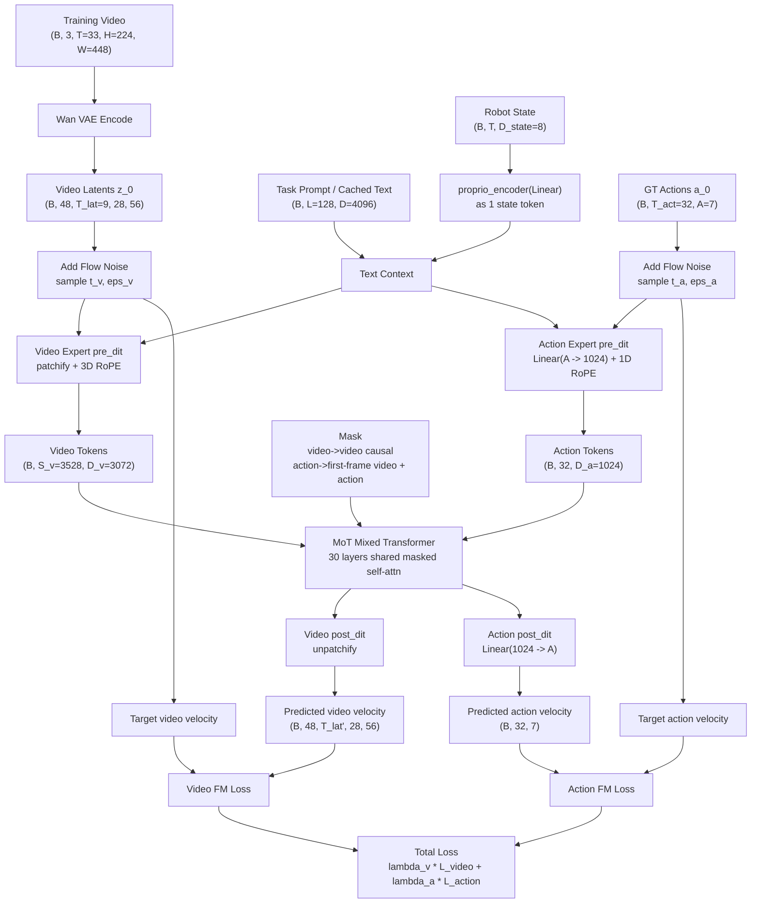
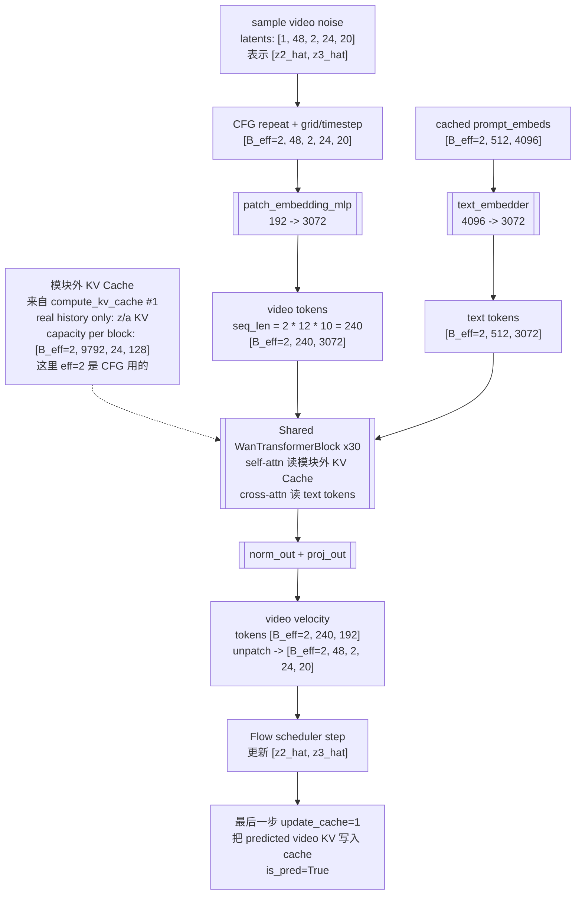
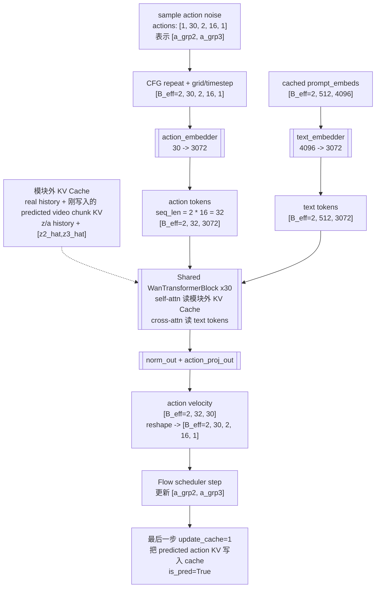
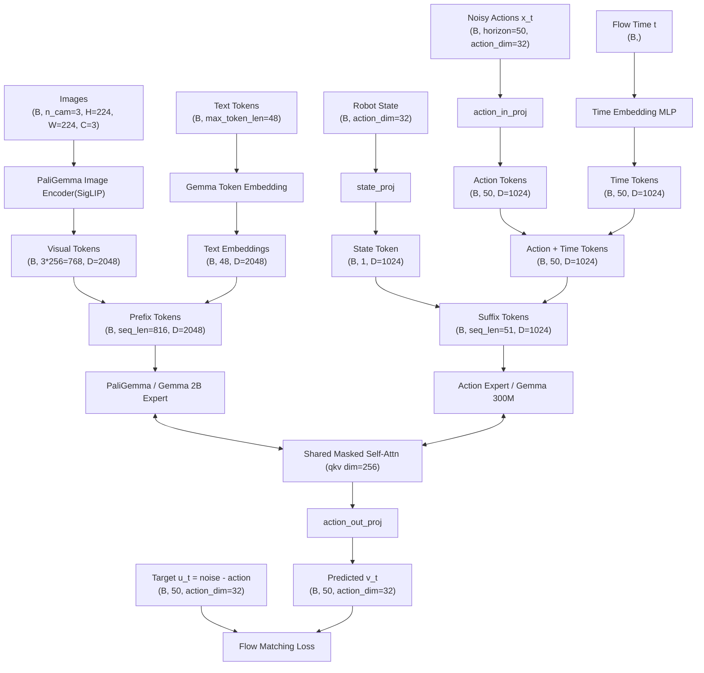
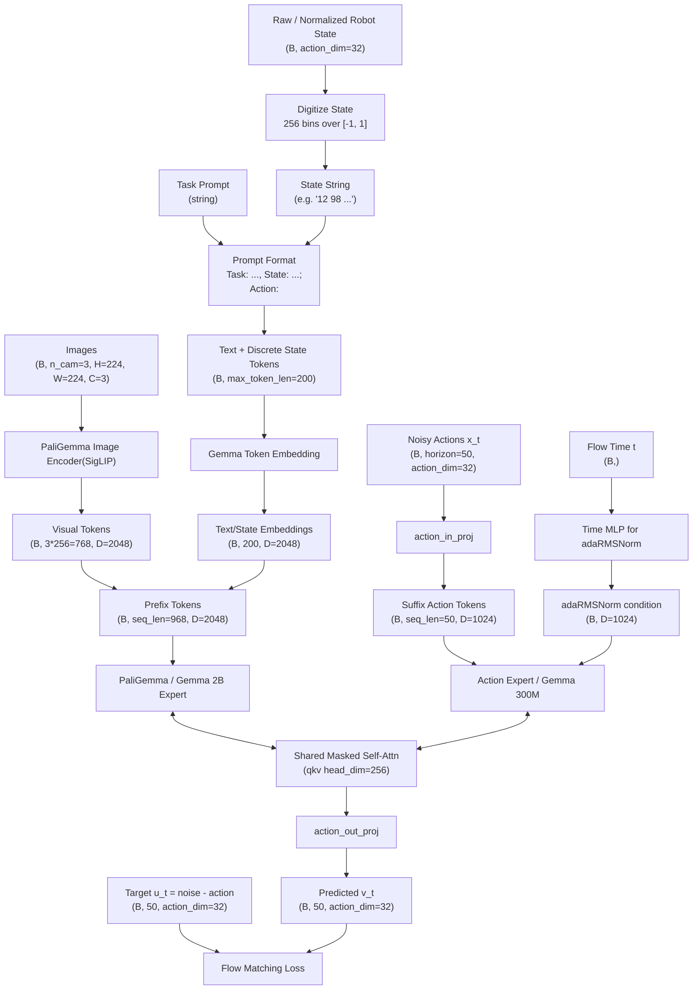
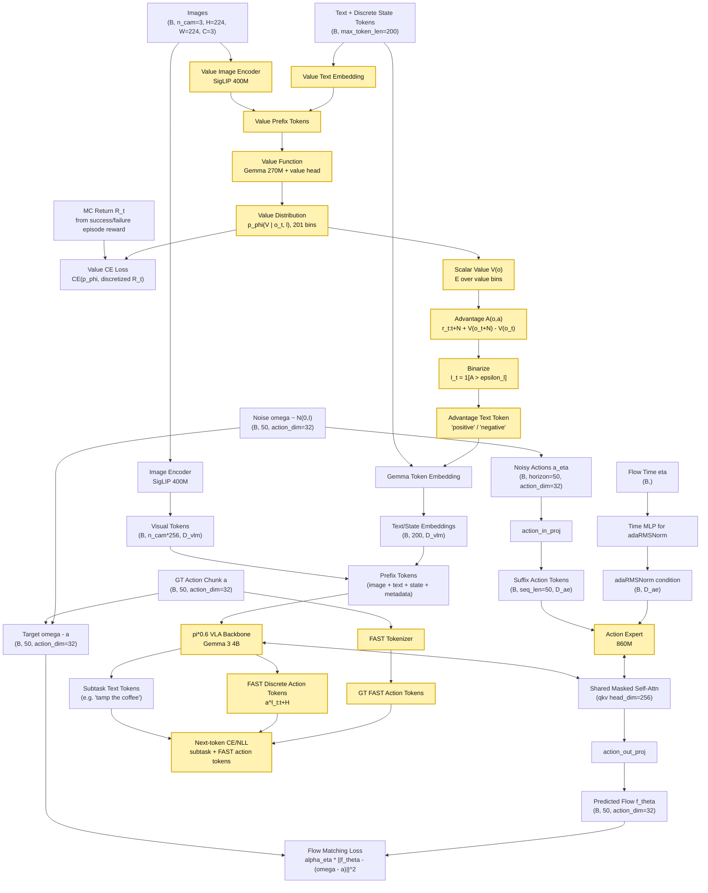

## RT-2 (1)
- https://hjfy.top/arxiv/2307.15818
和 OpenVLA 同属一派，将 VLM 的最后 256 个 token id 分配给动作，直接将 x, y, z, yaw, pitch, roll, gripper 划分为 256 个离散桶，七个动作维度共享 token id 并通过位置区分语义，直接拼接丢给 VLM 输出隐状态，一个 head 解码出 id 再映射回动作空间. 缺点是离散化和自回归导致的精度不够.

TODO: 数据集这一块儿有空可以再看看.

## World Model for Robot Learning: A Comprehensive Survey (2)
- https://hjfy.top/arxiv/2605.00080


## Fast-WAM (Yuanet al., 2026) (3)
- https://hjfy.top/arxiv/2603.16666
可被视为该家族中的一个混合点：它采用具有共享注意力的 Transformer 混合体骨干网络 及耦合的视频与动作分支，但结论认为主要优势可能更多来自训练期间的视频协同训练，而非推理阶段 的显式未来想象。在这些变体中，视频分支越来越不再被视为需要忠实渲染的输出，而是被看作一种预 测性潜在过程，其隐状态用于指导动作生成.

不论在 train-time 还是 infer-time, noisy action 都只会 attend 第一帧视频的 kv.
因此，train-time 联合训练多帧视频和动作生成的好处是逼着 video z_0 编码能够“从当前画面推导出未来变化”的信息。

> video loss: 让 z0 表征更懂未来/动力学
>
> action loss: 让 action expert 学会从这个 z0 表征里采样动作

所谓双 DiT，其实就是 MoT，即 video DiT 和 action DiT 在每个 transformer layer 通过 self-attention 双向注意.



## Lingbot-va (4)
- https://hjfy.top/arxiv/2601.21998

lingbot-va 的自回归扩散方法为：diffusion 后对 clean token 计算 kv 存入 kv cache，此后 diffusion 将会 attend 之前的 kv. 而 diffusion 顺序为 video 2 帧 -> action 2x16 帧（这部分相当于 IDM） -> video 2 帧 -> action 2x16 帧...

```python
obs0 -> VAE -> z0

infer #1 (frame_st_id=0):
1) flow denoise video chunk [z0_anchor, z1_hat]   # 2帧
   - 第0帧 init_latent=z0
   - 第1帧才是预测的未来 latent
2) flow denoise action chunk [a_grp0(16步), a_grp1(16步)]  # 1 chunk = 2 group(对齐 2 video frame) = 32 steps
   - 条件：cache(空) + 刚预测的 video chunk

execute #1（第一轮特殊）:
    start_idx=1 -> 跳过 a_grp0，只执行 a_grp1 的 16 步
    每 4 步收一次 obs -> key_frame_list（约 4 个真实 obs）

compute_kv_cache #1:
    clear_pred_cache()          # 删掉 z_hat、a_hat，不是“替换某几帧”
    real_z = VAE(key_frame_list)
    若 frame_st_id==0: cat(init_latent=z0, real_z)
    real_a = preprocess(executed action chunk)
    写入 cache（is_pred=False）

---

infer #2:
    预测下一个 chunk [z2_hat, z3_hat] + [a_grp2, a_grp3]
    条件：cache 里的 real history

execute #2 起:
    start_idx=0 -> 执行完整 32 步
    每 4 步收 obs -> key_frame_list（约 8 个）

compute_kv_cache #2:
    再次 clear_pred_cache()
    追加新的 real_z / real_a
```

### Infer-time denoise video


### Denoise action


## RTC (5)
from sergey. 直接魔改原有 action expert FM 过程：

```python
# 符号：H: (Prediction Horizon), M: 动作维度 (Action Dim), O: 观测维度
def rtc_inference(v_net, o_t, A_prev, d, s, n=5, beta=5):
    """
    变量：o_t: 观测 [O], A_prev: 旧动作块的残余部分 [H, M] (已 pad0 至H长度)
    d: 推理延迟 s: 执行步长 n: 迭代步数 beta: 引导项裁剪值
    """

    A_tau = torch.randn((H, M)) # [H, M] 采样初始噪声
    W = compute_soft_mask(d, s, H) # [H, 1] 软掩码权重，1 ~ 0递减
    for tau in np.linspace(0, 1, n):
        v = v_net(A_tau, o_t, tau) # [H, M] 当前速度场预测
        A_hat_1 = A_tau + (1 - tau) * v # [H, M] 无 guidance 情况下的最终动作
        loss = 0.5 * (W * (A_prev - A_hat_1)**2).sum() # 标量
        g = torch.autograd.grad(loss, A_tau)[0] # [H, M] 获取修正梯度，指引 A_tau 向 A_prev 靠拢
        scale = min(beta, get_weight_scale(tau)) # get_weight_scale 是一个随 tau 递减的权重
        A_tau += (1/n) * (v + scale * g) # [H, M] 结合原始预测与裁剪后的引导项进行更新
    return A_tau
```


## Pi0.6 & Pi0.5 & Pi0 (6,7,8)

Pi0 除了以下设计，还引入了 zero-padding 进行跨本体混合训练，即状态和动作向量长度设定为数据集中最大自由度，不足补 0. 模型只能通过输入的本体感知 $q_t$（例如 is_pad 信息？）和语言指令来识别当前的硬件构型. Pi0 并不能 zero-shot，但预训练能够帮助后训练的性能提升. 其他博主的一些理解：
> Pi0 分离 actor 和 VLM，是为了避免后训练中对 VLM 能力的灾难性破坏.
>
> Pi0 一次性引入了多个在后续被广泛使用的 Setting，当然，这些内容一开始的出处在这里不作考证，包括使用 MoT 进行 LLM 以及 Actor 的交互（见 Bagel ↗︎），使用 Flow Matching Loss 训练 Actor 以及使用 zero-padding 来进行跨本地的混合训练。



绘制 flowchart 要点：
- 可训练模型用 `node[[]]`，数据用 `node([])`，非可学习模块 `node[]`. train-time 如有冻结模块用🧊标识. 如果是 +/concat 等操作符直接写 +/concat 等.
- 文字简洁，用 `<br>` 换行，数据带上形状以及项目最默认配置的具体数值, e.g. (B=8, seq_len=50, D=1024)
- 非 fully attention 可标出谁提供 q/k/v，对于 q 可标出其 attend 目标，简述. fully attention 省略之.
- 画出重要模块，如 Embedding, RoPE, expert, FM, proj, MLP, loss，省略 layer norm 等不重要模块.

其中一个 layer 的伪代码:

```python
obs = norm_obs(obs0) # (B, Lo, 2048)
act = norm_act(act0) # (B, La, 1024)
q_obs = Wq_obs(obs).view(B, Lo, 8, 256).transpose(1, 2)   # (B, 8, Lo, 256)
k_obs = Wk_obs(obs).view(B, Lo, 1, 256).transpose(1, 2)   # (B, 1, Lo, 256)
v_obs = Wv_obs(obs).view(B, Lo, 1, 256).transpose(1, 2)   # (B, 1, Lo, 256)
q_act = Wq_act(act).view(B, La, 8, 256).transpose(1, 2)   # (B, 8, La, 256)
k_act = Wk_act(act).view(B, La, 1, 256).transpose(1, 2)   # (B, 1, La, 256)
v_act = Wv_act(act).view(B, La, 1, 256).transpose(1, 2)   # (B, 1, La, 256), Wv_act(act) is (B, La, 256)

q = cat([q_obs, q_act], dim=2)                            # (B, 8, Lo+La, 256)
k = repeat_kv(cat([k_obs, k_act], dim=2), n_rep=8)        # (B, 8, Lo+La, 256)
v = repeat_kv(cat([v_obs, v_act], dim=2), n_rep=8)        # (B, 8, Lo+La, 256)

y = softmax(q @ k.transpose(-2, -1)) @ v                  # (B, 8, Lo+La, 256)
y = y.transpose(1, 2).reshape(B, Lo+La, 2048)             # (B, Lo+La, 2048)

obs_y = Wo_obs(y[:, :Lo])                                 # (B, Lo, 2048)
act_y = Wo_act(y[:, Lo:])                                 # (B, La, 1024)
obs1 = gated_residual(obs0, obs_y)                              # (B, Lo, 2048)
act1 = gated_residual(act0, act_y)                              # (B, La, 1024)
```

下面是 pi0.5. 一句话：对 state 进行 bin 离散并以文本丢进 VLM，预训练则对 action 使用 FAST 分词器离散从而在不启用 action expert 的情况下进行 LLM-like NTP 预测并使用交叉熵 loss，目的是大幅加快训练，而 infer-time 用 flow matching 反而更快。然而，对于跨本体 state 似乎没有做特殊处理，而都是归一化，可能要通过语言指令来识别本体。架构细节包括:
- flow step 使用 adaRMSNorm.
- 在 pi0 中，state 是 linear 进 action expert，flow step 则 MLP 直接加到 action tokens 上.
- FAST tokenizer 就是先将整个 action chunk (原文说了是 compressing the action chunks) 先 encode 为 8 个 latent 然后 vector quantize 就完事. 最终将 50x19 action 转为 8 个 token.



pi0.6


## 总结

VLA 架构的大方向:
1. [VLM] -> embedding -> [MLP(i.e. action head)] -> action
2. [VLM] -> embedding -> kv -> [Decoder transformer, attended by learnable q pos embedding] -> [action head] -> action (ACT-like)
3. [VLM] -> MoT <-> [action expert] -> [action head] -> action (Pi-like)
