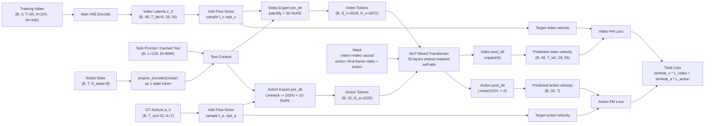
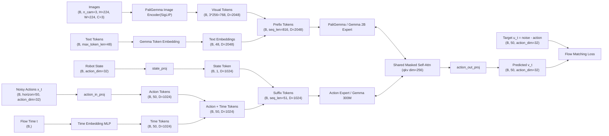

## RT-2 (1)
- https://hjfy.top/arxiv/2307.15818
和 OpenVLA 同属一派，将 VLM 的最后 256 个 token id 分配给动作，直接将 x, y, z, yaw, pitch, roll, gripper 划分为 256 个离散桶，七个动作维度共享 token id 并通过位置区分语义，直接拼接丢给 VLM 输出隐状态，一个 head 解码出 id 再映射回动作空间. 缺点是离散化和自回归导致的精度不够.

TODO: 数据集这一块儿有空可以再看看.

## World Model for Robot Learning: A Comprehensive Survey (2)
- https://hjfy.top/arxiv/2605.00080


## Fast-WAM (Yuanet al., 2026) (3)
- https://hjfy.top/arxiv/2603.16666
可被视为该家族中的一个混合点：它采用具有共享注意力的 Transformer 混合体骨干网络 及耦合的视频与动作分支，但结论认为主要优势可能更多来自训练期间的视频协同训练，而非推理阶段 的显式未来想象。在这些变体中，视频分支越来越不再被视为需要忠实渲染的输出，而是被看作一种预 测性潜在过程，其隐状态用于指导动作生成.

train-time 和 infer-time, noisy action 都只会 attend 第一帧视频的 kv.
因此，train-time 联合训练多帧视频和动作生成的好处是逼着 video z_0 编码能够“从当前画面推导出未来变化”的信息。

> video loss: 让 z0 表征更懂未来/动力学
>
> action loss: 让 action expert 学会从这个 z0 表征里采样动作



## Lingbot-va (4)
- https://hjfy.top/arxiv/2601.21998
- [ok] 自回归扩散
    - [ok] "对统一序列施加因果注意力掩码，确保预测的视觉状态和动作命令均受先前状态的约束"

```python
obs0 -> VAE -> z0

infer #1 (frame_st_id=0):
  1) flow denoise video chunk [z0_anchor, z1_hat]   # 2帧，不是(z1,z2)两个未来
     - 第0帧 init_latent=z0
     - 第1帧才是预测的未来 latent
  2) flow denoise action chunk [a_grp0(16步), a_grp1(16步)]  # 共32步
     - 条件：cache(空) + 刚预测的 video chunk
execute #1（第一轮特殊）:
  start_idx=1 -> 跳过 a_grp0，只执行 a_grp1 的 16 步
  每 4 步收一次 obs -> key_frame_list（约 4 个真实 obs）
compute_kv_cache #1:
  clear_pred_cache()          # 删掉 z_hat、a_hat，不是“替换某几帧”
  real_z = VAE(key_frame_list)
  若 frame_st_id==0: cat(init_latent=z0, real_z)
  real_a = preprocess(executed action chunk)
  写入 cache（is_pred=False）

infer #2:
  预测下一个 chunk [z2_hat, z3_hat] + [a_grp2, a_grp3]
  条件：cache 里的 real history
execute #2 起:
  start_idx=0 -> 执行完整 32 步
  每 4 步收 obs -> key_frame_list（约 8 个）
compute_kv_cache #2:
  再次 clear_pred_cache()
  追加新的 real_z / real_a
```



```mermaid
flowchart LR
    data["LeRobot + Latent Dataset<br/>videos already encoded by Wan VAE<br/>actions + action_config + text_emb"] --> video["Video Latents<br/>(B, C=48, F=2, H=24, W=20)"]
    data --> action["Normalized Actions<br/>(B, action_dim=30, F=2, action_per_frame=16, 1)"]
    data --> text["Action Text Embeddings<br/>(B, 512, text_dim=4096)"]

    video --> vnoise["Add Flow Noise<br/>sample t per frame"]
    vnoise --> noisyv["Noisy Video x_t<br/>(B,48,2,24,20)"]
    vnoise --> vtarget["Video Target u_t<br/>(B,48,2,24,20)"]
    video --> vcond["Clean / Noisy History Video<br/>(B,48,2,24,20)"]

    action --> anoise["Add Flow Noise<br/>sample action t per frame"]
    anoise --> noisya["Noisy Actions a_t<br/>(B,30,2,16,1)"]
    anoise --> atarget["Action Target u_t<br/>(B,30,2,16,1)"]
    action --> acond["Clean Action History<br/>(B,30,2,16,1)"]

    noisyv --> vtok["Video Patch Embed<br/>(B, seq_len=240, D=3072)"]
    vcond --> cvtok["Cond Video Tokens<br/>(B, 240, D=3072)"]
    noisya --> atok["Action Embedder<br/>(B, seq_len=32, D=3072)"]
    acond --> catok["Cond Action Tokens<br/>(B, 32, D=3072)"]
    text --> textproj["Text Projection<br/>(B,512,D=3072)"]

    vtok --> seq["Training Sequence<br/>[noisy video, cond video,<br/> noisy action, cond action]<br/>(B, seq_len=544, D=3072)"]
    cvtok --> seq
    atok --> seq
    catok --> seq

    seq --> mask["Flex Causal Mask<br/>teacher forcing over video/action history"]
    seq --> model["WanTransformer3DModel<br/>30 blocks, self-attn + text cross-attn"]
    textproj --> model
    mask --> model

    model --> vpred["Video Prediction<br/>(B,48,2,24,20)"]
    model --> apred["Action Prediction<br/>(B,30,2,16,1)"]

    vpred --> vloss["Video Flow Loss<br/>MSE(pred, target)"]
    vtarget --> vloss
    apred --> aloss["Action Flow Loss<br/>masked MSE(pred, target)"]
    atarget --> aloss

    vloss --> loss["Total Loss<br/>video_loss + action_loss"]
    aloss --> loss
    loss --> opt["Backward + AdamW<br/>save transformer checkpoint"]
```

## RTC (5)
```python
# H: (Prediction Horizon), M: 动作维度 (Action Dim), O: 观测维度
def rtc_inference(v_net, o_t, A_prev, d, s, n=5, beta=5):
    # o_t: 观测 [O], A_prev: 旧动作块的残余部分 [H, M] (已 pad0 至H长度)
    # d: 推理延迟 s: 执行步长 n: 迭代步数 beta: 引导项裁剪值
    A_tau = torch.randn((H, M))             # [H, M] 采样初始噪声
    W = compute_soft_mask(d, s, H)          # [H, 1] 软掩码权重，1 ~ 0递减
    for tau in np.linspace(0, 1, n):        # n 步流匹配迭代
        v = v_net(A_tau, o_t, tau)          # [H, M] 当前速度场预测
        # A_hat_1: [H, M] 预估当前步如果去噪完成后的最终动作轨迹
        A_hat_1 = A_tau + (1 - tau) * v
        # 计算带权重的 Inpainting 误差
        loss = 0.5 * (W * (A_prev - A_hat_1)**2).sum()  # 标量 Scalar
        # g: [H, M] 获取修正梯度，指引 A_tau 向 A_prev 靠拢
        g = torch.autograd.grad(loss, A_tau)[0]
        scale = min(beta, get_weight_scale(tau)) # get_weight_scale 是一个随 tau 递减的权重
        # A_tau: [H, M] 结合原始预测与裁剪后的引导项进行更新
        A_tau += (1/n) * (v + scale * g)
    return A_tau                            # [H, M] 平滑衔接的新动作块
```

## Pi0.6 & Pi0.5 & Pi0 (6,7,8)


下面是 pi0.5

```mermaid
flowchart LR
    img["Images<br/>(B, n_cam=3, H=224, W=224, C=3)"] --> siglip["PaliGemma Image Encoder(SigLIP)"]
    prompt["Task Prompt<br/>(string)"] --> format["Prompt Format<br/>Task: ..., State: ...;<br/>Action:"]
    rawstate["Raw / Normalized Robot State<br/>(B, action_dim=32)"] --> binstate["Digitize State<br/>256 bins over [-1, 1]"]
    binstate --> statestr["State String<br/>(e.g. '12 98 ...')"]
    statestr --> format
    format --> txt["Text + Discrete State Tokens<br/>(B, max_token_len=200)"]
    txt --> tok["Gemma Token Embedding"]

    siglip --> vis["Visual Tokens<br/>(B, 3*256=768, D=2048)"]
    tok --> textemb["Text/State Embeddings<br/>(B, 200, D=2048)"]
    vis --> prefix["Prefix Tokens<br/>(B, seq_len=968, D=2048)"]
    textemb --> prefix

    noisy["Noisy Actions x_t<br/>(B, horizon=50, action_dim=32)"] --> actproj["action_in_proj"]
    time["Flow Time t<br/>(B,)"] --> timemlp["Time MLP for adaRMSNorm"]

    actproj --> suffix["Suffix Action Tokens<br/>(B, seq_len=50, D=1024)"]
    timemlp --> adarms["adaRMSNorm condition<br/>(B, D=1024)"]

    prefix --> pg["PaliGemma / Gemma 2B Expert"]
    suffix --> ae["Action Expert / Gemma 300M"]
    adarms --> ae

    pg <--> shared["Shared Masked Self-Attn<br/>(qkv head_dim=256)"]
    ae <--> shared

    shared --> actout["action_out_proj"]
    actout --> vt["Predicted v_t<br/>(B, 50, action_dim=32)"]
    gt["Target u_t = noise - action<br/>(B, 50, action_dim=32)"] --> loss["Flow Matching Loss"]
    vt --> loss
```



pi0.6

```mermaid
flowchart LR
    img["Images<br/>(B, n_cam=3, H=224, W=224, C=3)"] --> siglip["Image Encoder<br/>SigLIP 400M"]
    txt["Text + Discrete State Tokens<br/>(B, max_token_len=200)"] --> tok["Gemma Token Embedding"]

    siglip --> vis["Visual Tokens<br/>(B, n_cam*256, D_vlm)"]
    tok --> textemb["Text/State Embeddings<br/>(B, 200, D_vlm)"]
    vis --> prefix["Prefix Tokens<br/>(image + text + state + metadata)"]
    textemb --> prefix

    noisy["Noisy Actions a_eta<br/>(B, horizon=50, action_dim=32)"] --> actproj["action_in_proj"]
    time["Flow Time eta<br/>(B,)"] --> timemlp["Time MLP for adaRMSNorm"]

    actproj --> suffix["Suffix Action Tokens<br/>(B, seq_len=50, D_ae)"]
    timemlp --> adarms["adaRMSNorm condition<br/>(B, D_ae)"]

    prefix --> pg["pi*0.6 VLA Backbone<br/>Gemma 3 4B"]
    suffix --> ae["Action Expert<br/>860M"]
    adarms --> ae

    pg <--> shared["Shared Masked Self-Attn<br/>(qkv head_dim=256)"]
    ae <--> shared

    shared --> actout["action_out_proj"]
    actout --> vt["Predicted Flow f_theta<br/>(B, 50, action_dim=32)"]
    gt["GT Action Chunk a<br/>(B, 50, action_dim=32)"] --> ftarget["Target omega - a<br/>(B, 50, action_dim=32)"]
    noise["Noise omega ~ N(0,I)<br/>(B, 50, action_dim=32)"] --> noisy
    noise --> ftarget
    ftarget --> floss["Flow Matching Loss<br/>alpha_eta * ||f_theta - (omega - a)||^2"]
    vt --> floss

    img --> vfsiglip["Value Image Encoder<br/>SigLIP 400M"]
    txt --> vftok["Value Text Embedding"]
    vfsiglip --> vfprefix["Value Prefix Tokens"]
    vftok --> vfprefix
    vfprefix --> vf["Value Function<br/>Gemma 270M + value head"]
    vf --> vdist["Value Distribution<br/>p_phi(V | o_t, l), 201 bins"]
    returns["MC Return R_t<br/>from success/failure episode reward"] --> vloss["Value CE Loss<br/>CE(p_phi, discretized R_t)"]
    vdist --> vloss
    vdist --> vscalar["Scalar Value V(o)<br/>E over value bins"]
    vscalar --> adv["Advantage A(o,a)<br/>r_t:t+N + V(o_t+N) - V(o_t)"]
    adv --> bin["Binarize<br/>I_t = 1[A > epsilon_l]"]
    bin --> advtxt["Advantage Text Token<br/>'positive' / 'negative'"]
    advtxt --> tok

    pg --> subtask["Subtask Text Tokens<br/>(e.g. 'tamp the coffee')"]
    pg --> fastout["FAST Discrete Action Tokens<br/>a^l_t:t+H"]
    gt --> fasttok["FAST Tokenizer"]
    fasttok --> fastgt["GT FAST Action Tokens"]
    subtask --> tokce["Next-token CE/NLL<br/>subtask + FAST action tokens"]
    fastout --> tokce
    fastgt --> tokce

    classDef pi06 fill:#fff2b3,stroke:#d6a600,stroke-width:2px,color:#111;
    class pg,ae,vfsiglip,vftok,vfprefix,vf,vdist,vscalar,adv,bin,advtxt,fastout,fasttok,fastgt,tokce pi06;
```

