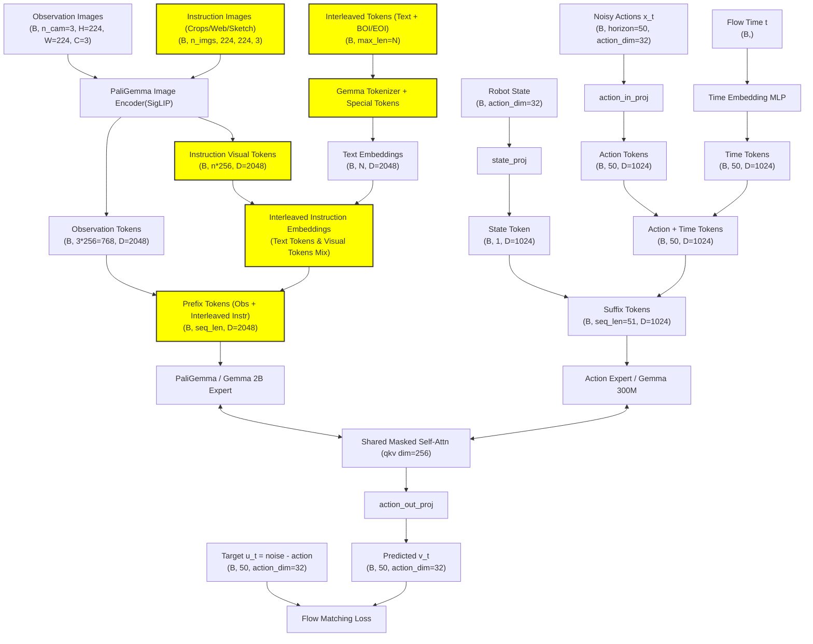
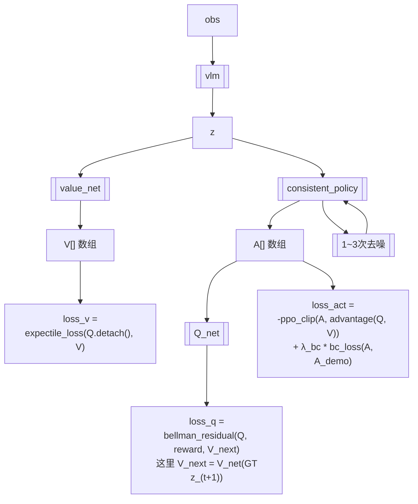
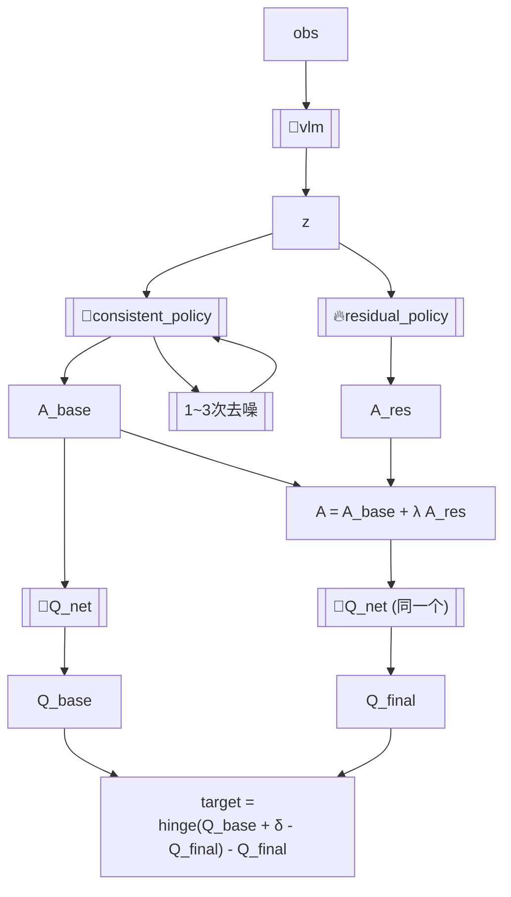

## ALOE (9): 智元 Rushuai Yang | Maoqing Yao
- https://arxiv.org/pdf/2602.22088

一句话：bc 预热后在 rollout 过程中训练一个 Q_net(critic) 支持干预，并从replay-buffer（原始数据、人类干预和历史rollout轨迹）中采样一个带奖励的转移 `(s, a_chunk, r_chunk, s_next)`，自举部分则使用 `Q_net(current_policy(s_next))`，估计悲观奖励 Q_pess 的同时更新 Q_net，随后 Q_net 评估 current_policy 在 `s` 处的多次采样平均表现. 如果 `a_chunk` 价值比 `s` 高则给 `a_chunk` 整个高权重. demo 装手机还不错.
- 实际上使用多个 Q_net 取 min 来进行悲观估计.
- Q_net 这部分看出是 off-policy 的，因为这里 `r` 来自 replay_buffer 而 `a_next = current_policy(s_next)` 则来自 current_policy. 这是 off-policy 多种形式中的一种.

## GreenVLA (10)
- https://hjfy.top/arxiv/2602.00919

有很多训练 trick，包括5阶段课程学习、质量指标筛选（公开数据集质量表）. 然而，demo 没有什么新东西。

## GuidedVLA: ybw (11)
一句话：给 pi0 action token 加手工设计的 auxiliary tasks.
- 让 action tokens 的 q 去 attend `depth_proj(depth_enc(img))` 的 kv 得到 y1
- 从 action tokens 学习新的 q 以及从 concat(image tokens, action tokens) 学习新的 kv 用于:
    - 计算 这里 qk 的 attn score，这个 score 和 GT attn mask patchify 得到 obj_loss (ground truth 由其他 grounding 模型生成)
    - 以及产生 pred_skill(one-hot，类似于 "pick" "place" "hold" 分类)，计算额外 skill_loss. 这里也会得到 y2 y3
    - action tokens += linear(concat(y1, y2, y3))
    - (代码中被称为 control_qkv)
- 以上带门控
- 以上给 action expert 的指定层去做，代码默认 [9, 10, 11, 12]  (pi0 expert 一共 18 层)

关于 control net
```python
output = original_attention(x) + # 这里是纯 pi0 的
  linear(control_attention(x)) # 只不过这里 linear 初始化为 0 防止初始就让老模型乱掉
```

## Interleave-VLA: fcx (12)

```patch
 # 输入包含当前观测图像、交错的图文指令及机器人状态
 # 使用 <BOI>/<EOI> 特殊 Token 标识指令中的参考图像
-instr_tokens = tokenizer.encode("把那个蓝色的带条纹的勺子放到盘子里") # 常规 VLA
+instr_tokens = tokenizer.encode(f"把 <BOI>{crop_img}<EOI> 放到盘子里") # 本方法，操作者在GUI手动框选目标
 obs_tokens = visual_encoder(current_observation)
 # 将观测、交错指令和本体感受状态拼接为统一序列
 input_seq = concat(obs_tokens, instr_tokens, robot_state)
 # VLA 模型直接生成连续动作序列
 actions = VLA_Model.predict(input_seq)
```



## Implicit RDP (13)
- https://hjfy.top/arxiv/2512.10946

一句话：在一个 img 周期内构建高频的短期 wrench kv memory 并在 train-time-only 加入 virtual_target 和 stiffness auxiliary tasks 来强制模型利用力信息，推理时仅需力传感器+位控且并且没有用 admittance control. 例如在插入书本等任务中，如果书本怼到墙壁能快速感知到并反应.

力 reactive + 位控比较适合上述书本插缝的情形，但并不适合套手机壳；后者更需要力控，但力控对于到达目标点的反应却更慢。两者之间存在 tradeoff. 从一个角度考虑，
人手没有编码器实际上不能做位控，机械臂擅长做位控任务，但前者却能实现一系列灵巧操作，到底是怎么控制的？

```python
noisy_action[i] ---attend--> noise_action[<=i] & fast_kv[<=i] & slow_kv
fast_kv[i] 内部为 GRU，slow_kv 内部为 obs_encoder
```

```python
# Train: 不用随机采样 fast kv length
# batch aligned around slow time S, with dense force covering slow history -> action horizon
slow_obs = {
    img:      img_slow[:, S-1:S+1],             # (B,2,3,360,640), slow history
    tcp_pose: tcp_slow[:, S-1:S+1],             # (B,2,6)
}
fast_obs = wrench_fast[:, F0:F0+16]             # (B,16,6),
a0 = action_aug[:, F0:F0+16]                    # (B,16,13), aug 的意思就是 6 tcp + 6 virtual target + 1 stiffness
slow_kv = SlowEncoder(slow_obs)                 # (B,~100,768), slow cross-attn K/V
fast_kv = FastGRU(fast_obs)                     # (B,16,768), causal fast K/V
eps = randn_like(a0); k = randint(0,K,(B,))
xk = add_noise(a0, eps, k)                      # (B,16,13), noisy action tokens / Q source
pred = Transformer(xk, k, slow_kv, fast_kv)     # (B,16,13), causal: action i sees fast_obs <= i
target = eps                                    # or v_target under v-prediction
loss = mean((pred - target) ** 2)               # diffusion loss over B x 16 x 13
```

实际上不论是采数据还是 infer-time，原始数据的 img, tcp_pose 和 wrench 都是同步同频率 (e.g 10hz)，只是 img, tcp_pose 大部分被忽略了.

```python
# Infer: slow #1: step_count % tcp_action_update_interval == 0, default update_interval=6
obs = env.get_obs(obs_steps=2)                         # 同频同步帧: img/tcp_pose/wrench, each length=2
slow_kv_1 = SlowEncoder(obs)                           # conceptually (B,102,768)
noise_1 = randn(B,16,13)                               # cached noisy trajectory for this chunk
# infer #1, step_count % 6 == 0
N = latency_step + 0 + n_obs_steps                     # default 2 + 0 + 2 = 4
ext_obs = env.get_obs(obs_steps=N)                     # recent N synchronized wrench frames
fast_kv = FastGRU(ext_obs["right_robot_tcp_wrench"])   # (B,4,768)
x = DDIM(noise_1[:, :N], slow_kv_1, fast_kv)           # (B,4,13)
execute(x[:, -1, :6])                                  # only tcp pose; vt/stiff discarded
# infer #2, same slow_kv/noise, step_count % 6 == 1
N = latency_step + 1 + n_obs_steps                     # 5
ext_obs = append_one_new_obs_and_keep_last_N(ext_obs)  # recent 5 synchronized wrench frames
fast_kv = FastGRU(ext_obs["right_robot_tcp_wrench"])   # (B,5,768)
x = DDIM(noise_1[:, :N], slow_kv_1, fast_kv)           # (B,5,13)
execute(x[:, -1, :6])
# infer #3 ...
N = latency_step + 2 + n_obs_steps                     # 6
fast_kv = FastGRU(recent_sync_wrench[:N])              # (B,6,768)
x = DDIM(noise_1[:, :N], slow_kv_1, fast_kv)
execute(x[:, -1, :6])
# ...
# next slow update when step_count % 6 == 0 again

obs = env.get_obs(obs_steps=2)
slow_kv_2 = SlowEncoder(obs)
noise_2 = randn(B,16,13)
```

## Adaptive Compliance Policy (14)
- https://arxiv.org/pdf/2410.09309

预测 virtual target 和 stiffness 从而在纯位控机器人上使用 admittance control


## VP-VLA: Zixuan wang 港科大 (15)

全程冻结 VLM 和 SAM 并直接在 pixel level 绘制锚点. 并且让 VLA 中的 VLM 对齐外部的 VLM.

## Do World... ? (16)
- ?teacher–student training framework

## BORA (17)

本文在离线训练 Q net, V net(仅用于辅助训练 Q_net) 的同时更新 vlm encoder，并在在线阶段冻结 Q，只额外训练一个 MLP 级别的 residual policy.
demo 很一般，仅限慢速 pick and place 以及食指大拇指的简单捏握.

### Offline RL

- expectile_loss: [todo]
  ```python
  diff = Q.detach() - V
  weight = torch.where(diff > 0, tau, 1 - tau)
  loss_v = torch.mean(weight * (diff**2))
  ```
- bellman_residual:
  ```python
  y_t = reward + gamma * (1 - done) * V_next
  loss_q = torch.mean((Q - y_t.detach())**2)
  ```

### Online RL


递归
- Q-chunking 就是本文使用的给 action_chunk 的每个位置打分.
- implicit Q learning ? 就是:
    - 非 implicit 更新 Q_net: `target = reward + gamma * max(Q_target(s_next, policy(s_next)))`. 如果 policy 输出 OOD 的动作，Q 的评分可能虚高，policy 被诱导去选择这些幻觉动作，导致整个评价体系崩溃.
    - implicit 更新 Q_net:
      ```python
      diff = Q.detach() - V
      weight = where(diff > 0, τ, 1 - τ) # 当 Q > V 时权重为 τ=0.7，当 Q < V 时权重为 1-τ
      # m_t_i 为有效步掩码（处理提前终止的情况）
      loss_V = mean(m_t_i * weight * (diff**2))
      target = reward + gamma * V(s_next)
      ```
    - 本文没有直接使用 IQL 而是使用了 IQL-style expectile.

## 一些概念
- stiffness: F = K * (x_des - x) + D * (v_des - v)，这里的 stiffness 就是 K. K 越大，同样的位置误差会产生越大的修正力/力矩.
- 力位混合控制：选择一些轴力控，一些轴位控. 如 X, Y 走位，Z 保持 10N 下压力. 力控目标通常是末端[Fx, Fy, Fz, Mx, My, Mz] 扭矩（例如 Mz 可以理解为绕 z 轴转，拧螺丝），控制器内部通过雅可比矩阵 `tau = J^T * wrench` 转换为各关节扭矩.

## Latent Policy Barrier (18)
- https://arxiv.org/abs/2508.05941

一句话: 在 diffusion 过程中加入 guidance 项使得下一时刻的潜在观测与最近专家潜在观测的距离尽量小.

具体而言，下一时刻的潜在观测是通过训练的动力学模型 `d(z_t, a_(t, chunk)) -> z_(t + tp)` 得到的，该模型的训练数据来自专家轨迹 + 早期 ckpt 的 rollout 轨迹，在 infer-time 冻结。而 guidance 要求 `d` 的参与，而前几个去噪步让 `d` 难以预测，因此文章在 100 步去噪的最后 10 步才执行 guidance.

## cosmos-policy

## Moto: Latent Motion Token as the Bridging Language for Learning Robot Manipulation from Videos

## WorldVLA

## SimpleVLA

## Wall-WM

## Forcy policy

## LIFT

## VLA-JEPA
- https://hjfy.top/arxiv/2602.10098

关于 latent-action pretraining drifting 的问题值得看看.

## End-to-end training of deep visuomotor policies 四大神仙

https://yipko.com/posts/work/pi0.7/

- offline: Conservative q-learning for offline reinforcement learning. 惩罚 OOD 动作
