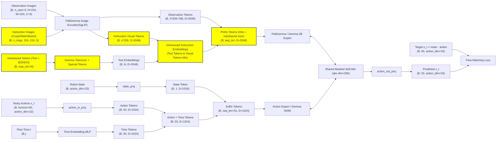

## ALOE:
递归学习..
- ?Q-chunking

## GreenVLA
- https://hjfy.top/arxiv/2602.00919
有很多训练 trick，包括5阶段课程学习、质量指标筛选（公开数据集质量表）. 然而，demo 没有什么新东西。

## GuidedVLA: ybw
一句话：给 pi0 action token 加手工设计的 auxiliary tasks.
- 让 action tokens 的 q 去 attend `depth_proj(depth_enc(img))` 的 kv 得到 y1
- 从 action tokens 学习新的 q 以及从 concat(image tokens, action tokens) 学习新的 kv 用于:
  - 计算 这里 qk 的 attn score，这个 score 和 GT attn mask patchify 得到 obj_loss (ground truth 由其他 grounding 模型生成)
  - 以及产生 pred_skill(one-hot，类似于 "pick" "place" "hold" 分类)，计算额外 skill_loss. 这里也会得到 y2 y3
  - action tokens += linear(concat(y1, y2, y3))
  - (代码中被称为 control_qkv)
- 以上带门控
- 以上给 action expert 的指定层去做，代码默认 [9, 10, 11, 12]  (pi0 expert 一共 18 层)

关于 control net
```python
output = original_attention(x) + # 这里是纯 pi0 的
  linear(control_attention(x)) # 只不过这里 linear 初始化为 0 防止初始就让老模型乱掉
```

## Interleave-VLA: fcx

```patch
 # 输入包含当前观测图像、交错的图文指令及机器人状态
 # 使用 <BOI>/<EOI> 特殊 Token 标识指令中的参考图像
-instr_tokens = tokenizer.encode("把那个蓝色的带条纹的勺子放到盘子里") # 常规 VLA
+instr_tokens = tokenizer.encode(f"把 <BOI>{crop_img}<EOI> 放到盘子里") # 本方法，操作者在GUI手动框选目标
 obs_tokens = visual_encoder(current_observation)
 # 将观测、交错指令和本体感受状态拼接为统一序列
 input_seq = concat(obs_tokens, instr_tokens, robot_state)
 # VLA 模型直接生成连续动作序列
 actions = VLA_Model.predict(input_seq)
```



## Implicit RDP
- https://hjfy.top/arxiv/2512.10946

一句话：在一个 img 周期内构建高频的短期 wrench kv memory 并在 train-time 添加 virtual_target 和 stiffness auxiliary tasks，推理时仅需力传感器+位控且并且没有用 admittance control. 例如在插入书本等任务中，如果书本怼到墙壁能快速感知到并反应.

```python
noisy_action[i] ---attend--> noise_action[<=i] & fast_kv[<=i] & slow_kv
fast_kv[i] 内部为 GRU，slow_kv 内部为 obs_encoder
```

```python
# Train: 不用随机采样 fast kv length
# batch aligned around slow time S, with dense force covering slow history -> action horizon
slow_obs = {
    img:      img_slow[:, S-1:S+1],             # (B,2,3,360,640), slow history
    tcp_pose: tcp_slow[:, S-1:S+1],             # (B,2,6)
}
fast_obs = wrench_fast[:, F0:F0+16]             # (B,16,6),
a0 = action_aug[:, F0:F0+16]                    # (B,16,13), aug 的意思就是 6 tcp + 6 virtual target + 1 stiffness
slow_kv = SlowEncoder(slow_obs)                 # (B,~100,768), slow cross-attn K/V
fast_kv = FastGRU(fast_obs)                     # (B,16,768), causal fast K/V
eps = randn_like(a0); k = randint(0,K,(B,))
xk = add_noise(a0, eps, k)                      # (B,16,13), noisy action tokens / Q source
pred = Transformer(xk, k, slow_kv, fast_kv)     # (B,16,13), causal: action i sees fast_obs <= i
target = eps                                    # or v_target under v-prediction
loss = mean((pred - target) ** 2)               # diffusion loss over B x 16 x 13
```

实际上不论是采数据还是 infer-time，原始数据的 img, tcp_pose 和 wrench 都是同步同频率 (e.g 10hz)，只是 img, tcp_pose 大部分被忽略了.

```python
# Infer: slow #1: step_count % tcp_action_update_interval == 0, default update_interval=6
obs = env.get_obs(obs_steps=2)                         # 同频同步帧: img/tcp_pose/wrench, each length=2
slow_kv_1 = SlowEncoder(obs)                           # conceptually (B,102,768)
noise_1 = randn(B,16,13)                               # cached noisy trajectory for this chunk
# infer #1, step_count % 6 == 0
N = latency_step + 0 + n_obs_steps                     # default 2 + 0 + 2 = 4
ext_obs = env.get_obs(obs_steps=N)                     # recent N synchronized wrench frames
fast_kv = FastGRU(ext_obs["right_robot_tcp_wrench"])   # (B,4,768)
x = DDIM(noise_1[:, :N], slow_kv_1, fast_kv)           # (B,4,13)
execute(x[:, -1, :6])                                  # only tcp pose; vt/stiff discarded
# infer #2, same slow_kv/noise, step_count % 6 == 1
N = latency_step + 1 + n_obs_steps                     # 5
ext_obs = append_one_new_obs_and_keep_last_N(ext_obs)  # recent 5 synchronized wrench frames
fast_kv = FastGRU(ext_obs["right_robot_tcp_wrench"])   # (B,5,768)
x = DDIM(noise_1[:, :N], slow_kv_1, fast_kv)           # (B,5,13)
execute(x[:, -1, :6])
# infer #3 ...
N = latency_step + 2 + n_obs_steps                     # 6
fast_kv = FastGRU(recent_sync_wrench[:N])              # (B,6,768)
x = DDIM(noise_1[:, :N], slow_kv_1, fast_kv)
execute(x[:, -1, :6])
# ...
# next slow update when step_count % 6 == 0 again

obs = env.get_obs(obs_steps=2)
slow_kv_2 = SlowEncoder(obs)
noise_2 = randn(B,16,13)
```

## Adaptive Compliance Policy
- https://arxiv.org/pdf/2410.09309


