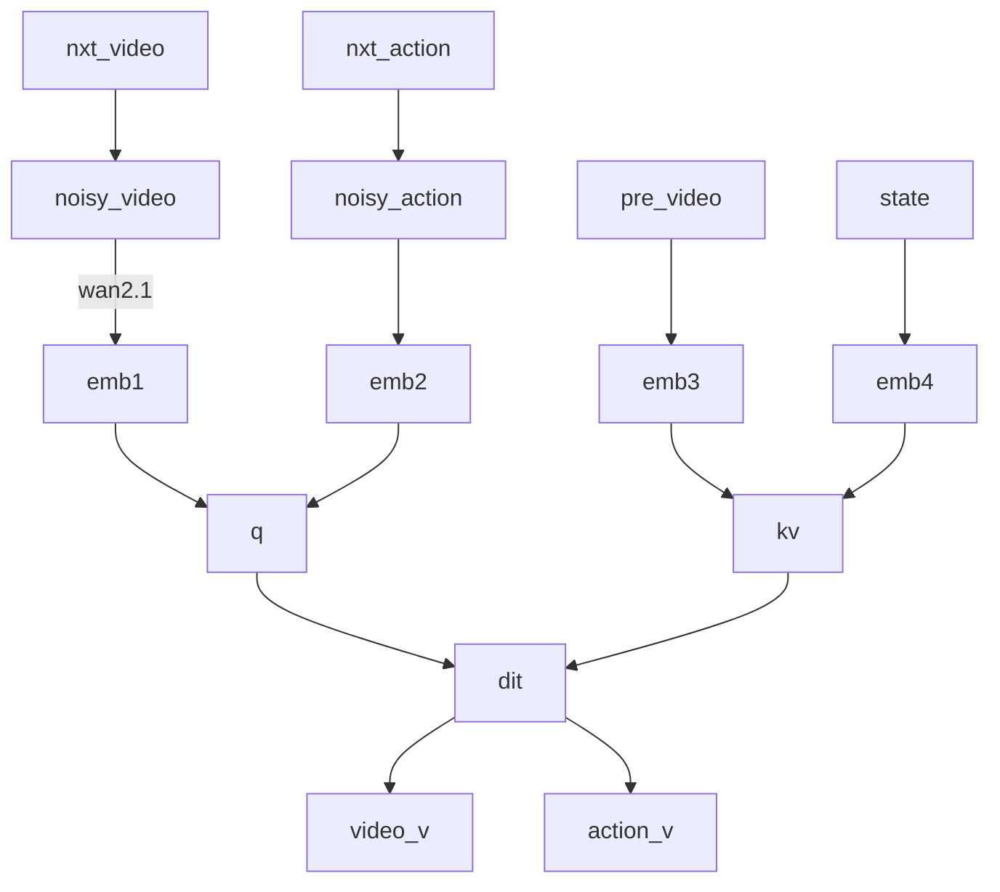

## DreamZero (21)
- ⭐️⭐️⭐️ https://hjfy.top/arxiv/2602.15922 | https://dreamzero0.github.io | agibot + NVIDIA | Seonghyeon Ye + Joel Jang

与 cosmos policy 不同, video backbone (Wan2.1，冻结) 用作编码器而单一 DiT 从 noise 中解码出 flow v (video v 和 action v，共享去噪时间步). DiT 利用 kv cache 实现了历史观测.

demo 亮点是 agibot-G1 穿鞋带以及 unseen 地前进按电梯按钮. 附录中有 train-infer 的 attn mask 设计和 infer 加速等不错的资料.




## EgoScale (22)
- ⭐️⭐️⭐️ https://hjfy.top/arxiv/2602.16710 : https://www.alphaxiv.org/abs/2602.16710 | https://research.nvidia.com/labs/gear/egoscale/ | NVIDIA | Ruijie Zhang + Linxin Fan

20000 小时数据灵巧手操作预训练，mid-training 和 post-training 实践。模型架构本质是 ACT-like，即 obs 和 lang 用 vlm 单独编码后作为 kv，而 dit 只用 action 来 query，没有 MoT. 三个阶段的训练为：
1. 预训练：解冻所有模块，包括 VLM(GROOT N1)，vision encoder，DiT 动作专家等，纯 RGB 数据用现成工具解算手部姿态和手腕轨迹，其中有 829 小时 vision pro 准确手腕+手部数据.
2. mid-training: 对同样的任务同时采集 30 条人类轨迹和 5 条机器人轨迹（50h人类 + 4h机器人，都使用 vive tracker + manus 手套）
3. post-training: 特定任务的机器人数据. 如果进行了 mid-trainig 则冻结视觉编码器，否则不冻结.


这个 demo 比较精彩，用 sharpa hand 实现了使用电动螺丝刀、试管吸液和双指拧瓶盖.

## LIFT: yi wang (23)

将预训练的 pi0.5 的 action expert 复制一份参数作为 learnable force expert，提供 1 秒的 force kv history. 通过 teleop online dagger 训练 force expert. LIFT 并非为了 contact-rich 场景设计，而是证明后训练阶段才引入 force 仍然是有价值的。不过 multi-task 能力还未开发（pi0.5 本身在这些任务上也不怎么 multitask）. 训练时输出 cmd 还是 state 也值得仔细思考，可从人类采集 & replay & rollout 角度考虑。

## VLA-JEPA (24)
⭐️⭐️⭐️ https://hjfy.top/arxiv/2602.10098 | Jingwen Sun, Zhibo Chen, 中科大

在 ACT-like(no MOT) 基础上加上 WM 和 latent action query 来利用 human video 进行 pretrain. （非具体动作，仅表征动力学）

下图中，V-JEPA 全程冻结，WM 是从零开始训练的 transformer，注意预测的是 V-JEPA 空间的潜在状态，而 latent-action 之前的就是一个 ACT-like.


## 名词补充 (25)
1. `RVQ`: residual VQ. 是一种简单的将 1 个连续变量离散化为多个 token 的方式. 被 RDT2 使用，声称比 FAST 等方法节约 2/3 的 token. RDT2 在 stage1 直接没有 flow matching 而是直接 NTP 出 action token 来 cross entropy loss，并认为这样能更好利用 VLM 已有的离散概率知识.
```python
r = z
for j in range(m):
    k_j = argmin_k ||r - e_j[k]||^2 # 在第 j 层代码本中寻找最接近残差的项索引
    r = r - e_j[k_j] # 下一层量化继续量化残差
```

## OneTwoVLA (26)
⭐️⭐️ 清华 Fanqi Lin, Yang Gao | https://one-two-vla.github.io | https://hjfy.top/arxiv/2505.11917 | https://www.alphaxiv.org/abs/2505.11917 | https://github.com/Fanqi-Lin/OneTwoVLA

为了引入 text-level reasoning 但又不想分为显式双系统，OneTwoVLA 使用 Pi0-like 架构中的 VLM 输出自回归输出 <BEGIN_OF_ACTION> 或 <BEGIN_OF_REASONING> token，如果是前者就继续走常规流程，后者就继续自回归生成 reasoning. 数据是分段手标的.

TODO:

https://yipko.com/posts/work/pi0.7/

## https://qwen.ai/blog?id=qwen-robotsuite
