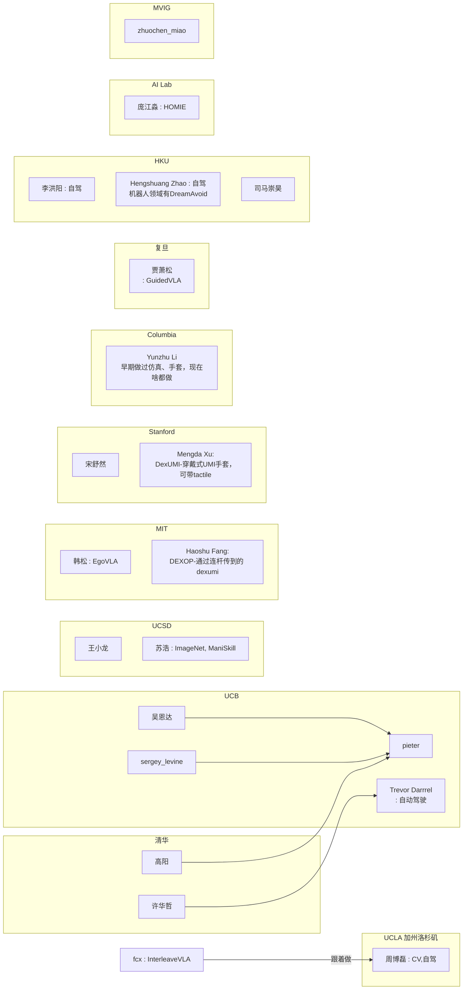
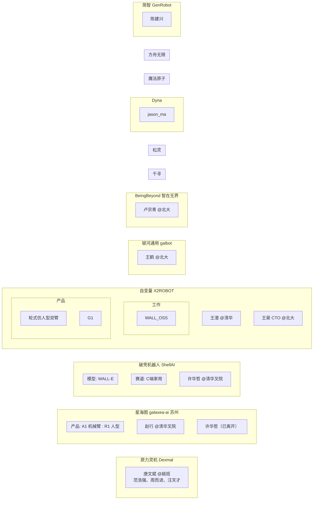

```mermaid
flowchart LR
    subgraph UCB
        wuenda[吴恩达] --> pieter
        sergey_levine --> pieter
        trevor_darrrel[Trevor Darrrel<br> : 自动驾驶]
    end

    subgraph 清华
        yang_gao[高阳] --> pieter
        huazhe[许华哲] --> trevor_darrrel
    end

    subgraph UCSD
        xiaolong_wang[王小龙]
        hao_su[苏浩 : ImageNet, ManiSkill]
    end

    subgraph MIT
        song_han[韩松 : EgoVLA]
        haoshu_fang[Haoshu Fang:<br>DEXOP-通过连杆传到的 dexumi]
    end

    subgraph Stanford
        shurang_song[宋舒然]
        mengda_xu[Mengda Xu:<br>DexUMI-穿戴式UMI手套，可带tactile]
    end

    subgraph Columbia
        yunzhu_li[Yunzhu Li<br>早期做过仿真、手套，现在啥都做]
    end

    fcx[fcx : InterleaveVLA] -->|"跟着做"| bolei_zhou
    subgraph UCLA 加州洛杉矶
        bolei_zhou[周博磊 : CV,自驾]
    end

    subgraph 复旦
        xiaosong_jia[贾萧松<br>: GuidedVLA]
    end

    subgraph HKU
        hongyang_li[李洪阳 : 自驾]
        hengshuang_zhao[Hengshuang Zhao : 自驾 <br> 机器人领域有DreamAvoid]
        chonghao[司马崇昊]
    end

    subgraph AI Lab
        jiangmiao_pang[庞江淼 : HOMIE]
    end

    subgraph MVIG
        zhuochen_miao
    end
```

```mermaid
flowchart LR
    subgraph 自变量 X2ROBOT
        qian_wang[王潜 @清华]
        hao_wang[王昊 CTO @北大]
        subgraph 工作
            WALL_OSS
        end
        subgraph 产品
            x2_a[轮式仿人型双臂]
        end
    end
    subgraph 原力灵机 Dexmal
        wenbin_tang[唐文斌 @姚班<br>范浩强、周而进、汪天才]
    end
    subgraph 星海图 galaxea-ai 苏州
        subgraph 产品: A1 机械臂 : R1 人型
        end
        hang_zhao[赵行 @清华叉院]
        huazhe_xu.1[许华哲（已离开）]
    end
    subgraph 破壳机器人 ShellAI
        subgraph 赛道: C端家用
        end
        subgraph 模型: WALL-E
        end
        huazhe_xu[许华哲 @清华叉院]
    end

    subgraph 银河通用 galbot
        he_wang[王鹤 @北大]
        subgraph 产品
            galbot_G1[G1]
        end
    end

    subgraph BeingBeyond 智在无界
        zongqing_lu[卢宗青 @北大]
    end

    subgraph 千寻
    end

    subgraph 松灵
    end
    subgraph Dyna
        jason_ma
    end
    subgraph 魔法原子
    end
    subgraph 方舟无限
    end
    subgraph 简智 GenRobot
        jianxing_chen[陈建兴]
    end
```

articles:
- https://zhuanlan.zhihu.com/p/655943844

archive commit: 0cdea62fe9eb778ef183587c52e3e89ae4d7514b

博客：
- 在我们组里工作过的 selen: https://selen-suyue.github.io/biosite/archives/
