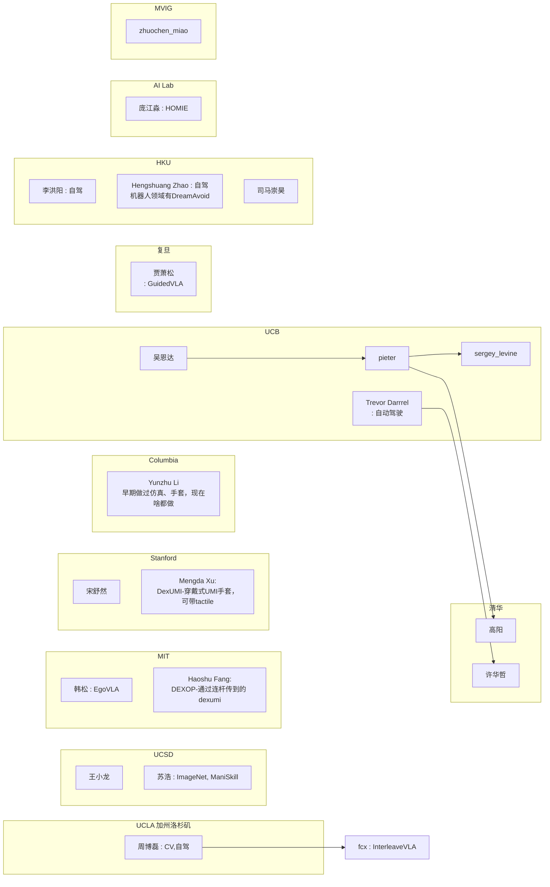
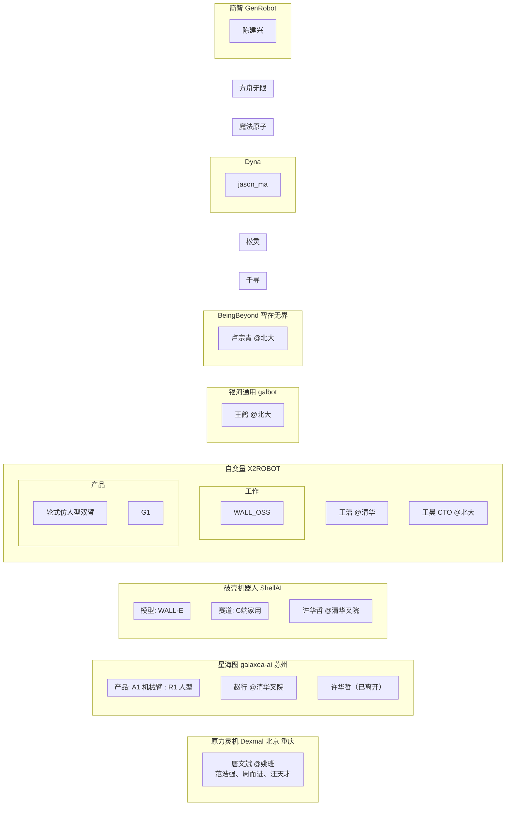

## Stanford 篇

### 核心人物

苏昊 (Hao Su)：
- 背景：本科北航，博士斯坦福（导师Leonidas J. Guibas），曾参与ImageNet。
- 贡献：参与ImageNet；发起ShapeNet；PointNet作者；推动3D视觉与具身智能；创办HillBot（2024年）。
- 关系：李飞飞学生；Leonidas学生；指导弋力、王鹤、莫凯淳等；与卢策吾合作推广具身智能。

弋力 (Li Yi)：
- 背景：斯坦福博士（导师Leonidas），2021年回国清华叉院。
- 贡献：ShapeNet核心成员；PartNet合作；推动3D部件分割与具身智能。
- 关系：苏昊师弟；与莫凯淳合作。

祁芮中台 (Charles R. Qi)：
- 背景：斯坦福博士，2019年加入Waymo，2024年加入Tesla FSD。
- 贡献：PointNet/PointNet++作者；影响自动驾驶感知。
- 关系：苏昊合作者；Leonidas学生。

卢策吾 (Cewu Lu)：
- 背景：中科院硕士、香港中文大学博士，斯坦福博后，2016年回国上海交大任教。
- 贡献：早期具身智能探索；GraspNet作者；创办非夕科技（2016年）和穹彻智能（2023年）。
- 关系：与苏昊、王世全合作；指导方浩树、李永露等学生。

王鹤 (He Wang)：
- 背景：斯坦福博士（导师Leonidas），2021年回国北大、北京智源人工智能研究院。
- 贡献：物理交互研究；GraspNeRF、DexGraspNet等；创办银河通用（2023年）。
- 关系：苏昊学生；与弋力合作。

王世全 (Shiquan Wang)：
- 背景：浙大本科、斯坦福博士（导师Mark Cutkosky、Oussama Khatib）。
- 贡献：机器人硬件专家；创办非夕科技（2016年）和穹彻智能（2023年）。
- 关系：卢策吾合作伙伴；专注“以力为中心”机器人。

黄其兴 (Qixing Huang)：
- 背景：斯坦福博士，后丰田芝加哥研究所。
- 贡献：支持ShapeNet；3D视觉研究。
- 关系：苏昊师兄；Leonidas学生。

莫凯淳 (Kaichun Mo)：
- 背景：上海交大本科、斯坦福博士，2022年加入英伟达。
- 贡献：PointNet参与；PartNet主力。
- 关系：苏昊指导学生；与弋力合作。

朱玉可 (Yuke Zhu)：
- 背景：浙大本科、斯坦福博士（导师李飞飞），2024年英伟达GEAR领导。
- 贡献：Visual Genome；早期机器人研究。
- 关系：与卢策吾合作讨论具身智能。

范麟熙 (Jim Fan)：
- 背景：斯坦福学生，2024年英伟达GEAR领导。
- 贡献：机器人研究。
- 关系：李飞飞学生；与朱玉可合作。

夏斐 (Fei Xia)：
- 背景：斯坦福博士（导师Leonidas、Silvio Savarese），后谷歌DeepMind。
- 贡献：RT-1/RT-2核心成员。
- 关系：Leonidas学生。

### 辅助人物
- 李飞飞 (Fei-Fei Li)：苏昊导师；ImageNet发起人；推动机器人与具身智能。
- Leonidas J. Guibas：斯坦福几何计算组主任；苏昊、弋力、王鹤、祁芮中台等导师。
- 沈向洋 (Harry Shum)：MSRA；苏昊导师。
- 孙剑 (Jian Sun)：MSRA视觉研究；苏昊导师。
- 吴恩达 (Andrew Ng)：苏昊实习导师；强化学习影响。
- Robert Schapire：普林斯顿教授；对视觉发展悲观。
- 顾春辉：伯克利博士；苏昊朋友。
- Manolis Savva & Angel Chang：斯坦福学生；ShapeNet合作者。
- 肖建雄 & 宋舒然：普林斯顿；ModelNet作者。
- 严梦媛、王鹤、邵林、淦创：斯坦福学生；具身智能早期参与。
- 方浩树、李永露、徐文强、王辰：卢策吾学生；具身智能本土博士。
- 陈睿、顾家远、秦誉哲、黄志翱、项帆波、刘明华、张孝帅：苏昊UCSD学生；具身智能研究。
- 陈文徵、高俊：苏昊指导；3D生成研究。
- 其他：Jitendra Malik、Pieter Abbeel、Ravi Ramamoorthi、Jeannette Bohg、Dieter Fox、张宏江、蒋树强等（导师或合作者）。

### 关键事件时间线
- 2005-2008：苏昊本科北航，导师李未；进入MSRA实习，导师沈向洋、周明、孙剑；接触AI、NLP、计算机视觉。邻座徐立、何恺明。
- 2008-2009：苏昊到普林斯顿参与ImageNet；李飞飞转斯坦福，苏昊跟随；Object Bank合作。
- 2010：苏昊在吴恩达组实习，提出端到端想法（类似AlexNet），未获支持；转向3D视觉，加入Leonidas组。
- 2012：AlexNet诞生，ImageNet推动2D视觉崛起；苏昊反思，坚定端到端前景。
- 2014：苏昊向Leonidas“推销”3D数据集想法；弋力加入；与Manolis Savva、Angel Chang合作；ShapeNet启动，第一版完成（3D数据收集、清洗）；普林斯顿ModelNet发布。
- 2015：ShapeNet第二版（加部件分割标注）；卢策吾到斯坦福博后，与朱玉可讨论机器人。
- 2016：ShapeNet完成（300万模型）；PointNet/PSGN等算法开发；卢策吾、王世全等创办非夕科技；具身智能萌芽（苏昊、卢策吾讨论机器人）；严梦媛、王鹤等加入Leonidas组；SUNC G数据集侵权事件，ShapeNet部分开放。
- 2017：PointNet/PointNet++发布（引用超1万）；苏昊到UCSD任教；3D视觉论文占比从<10%升至70%；卢策吾回上海交大，招方浩树等学生。
- 2018：苏昊斯坦福毕业；ECCV workshop“仿真环境中的视觉学习与具身智能体”（苏昊、弋力、卢策吾、黄其兴组织）；具身智能热度不高；弋力、王鹤转3D；严梦媛等转Jeannette Bohg组。
- 2019：卢策吾团队IROS两篇具身智能论文（Peg-in-hole、奖励塑造）；GraspNet发布；苏昊团队优化Sim2Real、WGAN等；SAPIEN仿真引擎发布；王鹤视觉-语言-行为模型（Eurographics最佳提名）。
- 2020：卢策吾VALSE首次谈具身智能（反应冷淡）；苏昊ManiSkill大赛；RFUniverse、BEHAVIOR、IsaacSim等仿真器发布；GraspNet全球首个AI通用抓取。
- 2021：ICCV workshop“The 1st Workshop on Simulation Technology for Embodied AI”（苏昊、王鹤、弋力组织）；弋力回清华、王鹤回北大；VALSE具身智能workshop启动；PartNet发布；DREDS传感器仿真器。
- 2022：CAAI具身智能专委会成立；VALSE具身智能workshop听众多；王鹤GraspNeRF、DexGraspNet等；莫凯淳加入英伟达。
- 2023：谷歌RT-1发布（“GPT-3时刻”）；具身智能大火；王鹤创办银河通用（Galbot G1，纯仿真95%成功率）；卢策吾创办穹彻智能；Open X Embodiment数据集（上海交大参与）；VALSE具身智能workshop火爆。
- 2024：苏昊创办HillBot（CTO）；祁芮中台加入Tesla；VALSE具身智能tutorial（王鹤主讲）；朱玉可、Jim Fan领导英伟达GEAR。

# UCB 篇

## 核心人物

Pieter Abbeel
- 背景：比利时裔美国计算机科学家，博士毕业于斯坦福大学，导师为Andrew Ng；2008年加入加州大学伯克利分校，任EECS教授，长期主持Berkeley Robot Learning Lab。
- 贡献：推动机器人模仿学习、深度强化学习和端到端控制；代表性工作包括Guided Policy Search、深度视觉运动策略、机器人技能学习和大规模机器人数据集；参与创建Berkeley AI Research（BAIR）。
- 产业：2017年与Peter Chen、Rocky Duan、Tianhao Zhang等共同创办Covariant，致力于仓储机器人和通用机器人智能；同时参与Gradescope和AIX Ventures。
- 关系：Andrew Ng学生；Sergey Levine、Chelsea Finn、Deepak Pathak等伯克利机器人学习研究者的重要导师或合作者；与Ken Goldberg长期合作。

Sergey Levine
- 背景：博士毕业于斯坦福大学，导师为Andrew Ng；曾在Google Brain研究，2016年前后加入UC Berkeley任教。
- 贡献：深度强化学习、离线强化学习、视觉控制和机器人策略学习的重要推动者；代表工作包括Guided Policy Search、Stochastic Value Gradients、Soft Actor-Critic（SAC）、视觉强化学习和机器人元学习。
- 产业：2024年成为Physical Intelligence联合创始人之一，参与开发面向通用机器人的基础模型和机器人策略。
- 关系：Andrew Ng学生；与Pieter Abbeel共同构成伯克利“深度强化学习—机器人学习”主线；指导或影响Chelsea Finn、Abhishek Gupta、Sudeep Dasari等研究者。

### Ken Goldberg

- 背景：博士毕业于卡内基梅隆大学，1990年代加入UC Berkeley，长期任IEOR与EECS教授，主持AUTOLab。
- 贡献：机器人抓取、自动化、人机协作、云机器人和医疗机器人领域的代表人物；创建Dex-Net系列，推动利用合成数据和深度学习进行可靠抓取；参与发起Robot Learning Foundation和Conference on Robot Learning（CoRL）。
- 产业：共同创办Ambi Robotics，将仿真训练、抓取学习和仓储分拣系统商业化；另共同创办Jacobi Robotics。
- 关系：伯克利机器人与自动化传统的重要奠基者之一；与Pieter Abbeel、Jeff Mahler等在机器人抓取和学习方面有合作。

### Anca Dragan

- 背景：博士毕业于卡内基梅隆大学，导师为Siddhartha Srinivasa；2015年加入UC Berkeley，后进入OpenAI。
- 贡献：人机协作、可解释机器人、机器人对人类意图的推断、协作式规划和反向奖励设计；代表性工作包括Coactive Learning、Inverse Reward Design及人机协同控制。
- 关系：与Pieter Abbeel、Sergey Levine所在的伯克利机器人学习群体有交叉合作；其研究将“机器人如何完成任务”扩展到“机器人如何理解并协助人类”。

### Chelsea Finn

- 背景：本科毕业于斯坦福，博士毕业于UC Berkeley，导师为Pieter Abbeel；曾在Google Brain工作，后任Stanford教授。
- 贡献：提出Model-Agnostic Meta-Learning（MAML），推动机器人少样本学习、视觉模仿学习和跨任务泛化；代表性工作包括MAML、One-Shot Visual Imitation Learning、元强化学习和机器人通用策略。
- 产业：Physical Intelligence联合创始人之一，参与开发机器人基础模型π系列。
- 关系：Pieter Abbeel学生；与Sergey Levine在机器人策略学习和通用机器人智能方向上形成伯克利—斯坦福—产业界的连续谱系。

### Deepak Pathak

- 背景：博士毕业于UC Berkeley，导师为Pieter Abbeel；后加入卡内基梅隆大学任教。
- 贡献：内在动机、无监督视觉表征、机器人自主探索和视觉预测；代表性工作包括Curiosity-driven Exploration、Learning without Forgetting、Visual Foresight和ViNG。
- 关系：Pieter Abbeel学生；与Sergey Levine、Chelsea Finn等共同推动从“单任务控制”向“可迁移机器人技能学习”转变。
- 产业：2023年前后参与创办Skild AI，探索面向机器人和具身智能的通用模型。

### Peter Chen

- 背景：伯克利机器人学习研究者，曾在Pieter Abbeel团队工作。
- 贡献：机器人视觉、策略学习和通用机器人系统研究。
- 产业：Covariant联合创始人，负责将伯克利机器人学习研究转化为仓储分拣和工业机器人系统。
- 关系：Pieter Abbeel团队成员；与Rocky Duan、Tianhao Zhang共同构成Covariant的伯克利创业班底。

### Rocky Duan

- 背景：伯克利机器人学习研究者，长期参与深度强化学习与机器人策略研究。
- 贡献：深度强化学习、机器人操作和大规模策略训练；参与推动机器人从实验室控制器向可部署系统演进。
- 产业：Covariant联合创始人。
- 关系：Pieter Abbeel、Peter Chen等合作者；属于伯克利机器人学习实验室向产业界外溢的代表人物。

### Tianhao Zhang

- 背景：伯克利机器人学习研究者。
- 贡献：机器人学习、深度强化学习及策略泛化。
- 产业：Covariant联合创始人之一，参与建立面向工业机器人的“机器人智能”系统。
- 关系：Pieter Abbeel团队成员；与Peter Chen、Rocky Duan共同将伯克利的机器人学习研究转化为商业产品。

## 辅助人物

- Andrew Ng：斯坦福与Baidu AI的重要人物，Pieter Abbeel和Sergey Levine的博士导师；其强化学习与机器学习研究对伯克利机器人学习谱系影响深远。
- Jeff Mahler：伯克利AUTOLab研究者，Dex-Net核心作者之一，后参与机器人抓取产业化。
- Abhishek Gupta：伯克利机器人学习研究者，参与视觉运动控制、策略学习和机器人操作。
- Sudeep Dasari：伯克利机器人学习研究者，参与RoboNet、机器人数据集与跨机器人策略学习。
- Animesh Garg：曾在伯克利从事机器人学习与视觉控制研究，后任多伦多大学教授。
- Yi Li：伯克利机器人学习研究者，参与策略学习与机器人操作。
- Shikhar Bahl：伯克利机器人学习研究者，参与视觉强化学习、机器人操作和通用策略研究。
- Stephen Tu：伯克利强化学习研究者，参与Soft Actor-Critic及连续控制相关工作。
- Chelsea Finn、Sergey Levine、Pieter Abbeel：伯克利机器人学习谱系中最重要的“导师—学生—合作者”三角关系。
- BAIR研究群体：包括Trevor Darrell、Jitendra Malik、Stuart Russell、Dawn Song等，虽然不都直接从事机器人，但共同构成伯克利视觉、机器学习、语言和决策研究基础。
- Berkeley DeepDrive：由伯克利视觉、自动驾驶和机器人研究者共同推动，促进感知、仿真和机器人系统研究向产业转化。

## 关键事件时间线

### 2008—2012：伯克利机器人学习基础形成

- 2008年前后，Pieter Abbeel加入UC Berkeley，建立Berkeley Robot Learning Lab。
- 伯克利开始系统研究模仿学习、机器人示范学习和高维传感器输入下的控制。
- Guided Policy Search等工作尝试把深度视觉表征与机器人控制结合起来，为后来的端到端机器人策略奠定基础。
- Andrew Ng门下的博士生和研究者逐渐分布到Stanford、Berkeley、Google Brain等机构，形成早期深度学习与机器人学习网络。

### 2013—2015：深度强化学习进入机器人

- Sergey Levine加入伯克利机器人学习研究体系，推动深度强化学习用于连续控制和视觉运动策略。
- Berkeley团队研究从传统的模型控制、轨迹优化逐步转向神经网络策略和价值函数。
- BRETT等机器人项目展示了机器人利用视觉和深度学习完成装配、操作任务的可能性。
- Pieter Abbeel团队与Google、OpenAI等研究群体形成密切合作，伯克利成为深度强化学习机器人研究中心之一。

### 2015—2016：BAIR成立，机器人学习与AI汇流

- 2015—2016年前后，Berkeley AI Research（BAIR）成立，将计算机视觉、机器学习、自然语言处理和机器人研究整合起来。
- Ken Goldberg的AUTOLab继续推进机器人抓取、自动化和云机器人。
- Dex-Net项目开始使用大规模合成数据训练抓取模型，探索机器人在现实仓储环境中的可靠操作。
- Berkeley的研究重点从“单个机器人完成单个任务”转向“利用数据和算法学习可泛化技能”。

### 2016—2017：SAC、MAML与机器人学习产业化前夜

- Sergey Levine及其合作者提出Soft Actor-Critic（SAC），成为连续控制和机器人强化学习中应用最广泛的方法之一。
- Chelsea Finn在伯克利完成MAML相关工作，推动少样本学习和跨任务快速适应。
- Pieter Abbeel、Sergey Levine和Ken Goldberg分别从策略学习、强化学习和抓取自动化推进机器人智能。
- Covariant成立，伯克利机器人学习成果开始直接进入仓储分拣和工业自动化领域。

### 2018—2019：大规模机器人数据与无监督学习

- Chelsea Finn离开伯克利后进入Stanford，继续发展元学习和机器人通用策略。
- Deepak Pathak等人研究内在动机、视觉预测和自主探索，尝试让机器人在缺少人工标注的情况下学习。
- RoboNet发布，汇集来自不同实验室和不同机器人平台的交互数据，推动“数据规模”成为机器人学习的重要变量。
- Berkeley团队逐渐形成“仿真—真实机器人—跨平台数据”的研究路线。

### 2020—2021：从单任务策略到可迁移技能

- 伯克利及其合作团队持续研究视觉强化学习、离线强化学习、机器人模仿学习和跨任务泛化。
- CQL等离线强化学习方法得到广泛关注，使机器人能够利用既有数据学习，而不必完全依赖在线试错。
- BridgeData等项目扩大机器人示范数据规模，推动多任务、多机器人策略训练。
- Anca Dragan在人机协作和机器人价值对齐方面的工作，使具身智能研究从纯粹的控制问题扩展到人与机器人共同决策。

### 2022：机器人基础模型的前夜

- 伯克利研究者参与视觉—语言—动作模型、机器人示范学习和大规模策略预训练。
- 研究重点逐步由“强化学习算法性能”转向“机器人能否从互联网规模数据、跨平台数据和人类示范中学习”。
- Pieter Abbeel、Sergey Levine及其学生和合作者开始更多进入产业界、风险投资和机器人创业生态。

### 2023：通用机器人策略与产业创业升温

- Berkeley团队参与BridgeData V2、Octo等开放机器人策略和数据项目，推动开源通用机器人策略的发展。
- Covariant推出面向仓储机器人的通用机器人智能系统，强调通过数据持续学习新任务。
- Deepak Pathak参与创办Skild AI，探索机器人基础模型。
- 以伯克利为中心的机器人学习网络与Stanford、CMU、Google DeepMind、OpenAI等机构进一步融合。

### 2024：Physical Intelligence与机器人基础模型

- Sergey Levine和Chelsea Finn成为Physical Intelligence联合创始人，参与开发π系列机器人基础模型。
- 伯克利机器人学习思想开始以“机器人基础模型”“跨任务策略”“视觉—语言—动作模型”等形式进入产业主流。
- Ken Goldberg继续推进抓取自动化、仓储机器人和医疗机器人。
- Pieter Abbeel则同时活跃于Covariant、Berkeley Robot Learning Lab和AI投资领域，成为连接学术界、产业界与创业生态的关键人物。

## UCB谱系的主要特征

与Stanford以3D视觉、几何计算和仿真环境为主线的谱系相比，UCB的具身智能发展更集中在以下几条路径：

1. **机器人学习**：从示范学习、Guided Policy Search发展到深度强化学习和通用策略。
2. **强化学习**：SAC、离线强化学习和视觉强化学习成为机器人决策的重要基础。
3. **机器人抓取**：Dex-Net将合成数据、几何建模和深度学习结合起来，直接面向仓储和工业部署。
4. **大规模数据**：RoboNet、BridgeData等项目将多机器人数据和跨平台泛化带入研究主流。
5. **人机协作**：Anca Dragan等人把人类意图、价值对齐和协同决策纳入具身智能。
6. **产业外溢**：Covariant、Ambi Robotics、Skild AI、Physical Intelligence等公司，构成伯克利机器人学习成果商业化的主要出口。

## 关系简图

```text
Andrew Ng（Stanford）
        │
        ├── Pieter Abbeel ── Berkeley Robot Learning Lab / BAIR
        │        ├── Chelsea Finn ── Stanford / Physical Intelligence
        │        ├── Deepak Pathak ── CMU / Skild AI
        │        ├── Peter Chen ── Covariant
        │        ├── Rocky Duan ── Covariant
        │        └── Tianhao Zhang ── Covariant
        │
        └── Sergey Levine ── Berkeley / Physical Intelligence

Ken Goldberg ── AUTOLab / Dex-Net / Ambi Robotics
Anca Dragan ── Berkeley HRI / OpenAI
```

# markdown li

感觉 mermaid 还是不太行，来个 markdown li + 自然叙述
- Fang 方浩树: 卢老板学生，MIT 博士后。代表作 GraspNet.
- Jason Ma: 马也骋，Dyna
- Ren 任至意: 又称 Allen Ren，做 Pi 的预训练
- Su 苏航: 交大毕业，现在清华.
- Su 苏昊: 本科北航，博士斯坦福. 参与 ImageNet.
- Wang 王尊玄: Genesis
- Xu 徐丹飞: 佐治亚理工，同时在 NVIDIA. EgoMimic 通讯作者，参与 OXE. 他比较相信 Ego.
- Yao 姚卯青: 智元合伙人，觅蜂科技 CEO.
- Yi 弋力：

企业
- 大咖机器人：文强哥
- Dyna：CEO 为 Jason Ma. 总部在硅谷，分部在上海长宁区.

# mermaid





articles:
- https://zhuanlan.zhihu.com/p/655943844
- https://zhuanlan.zhihu.com/p/1942577585402909352

archive commit: 0cdea62fe9eb778ef183587c52e3e89ae4d7514b

博客：
- 在我们组里工作过的 selen: https://selen-suyue.github.io/biosite/archives/