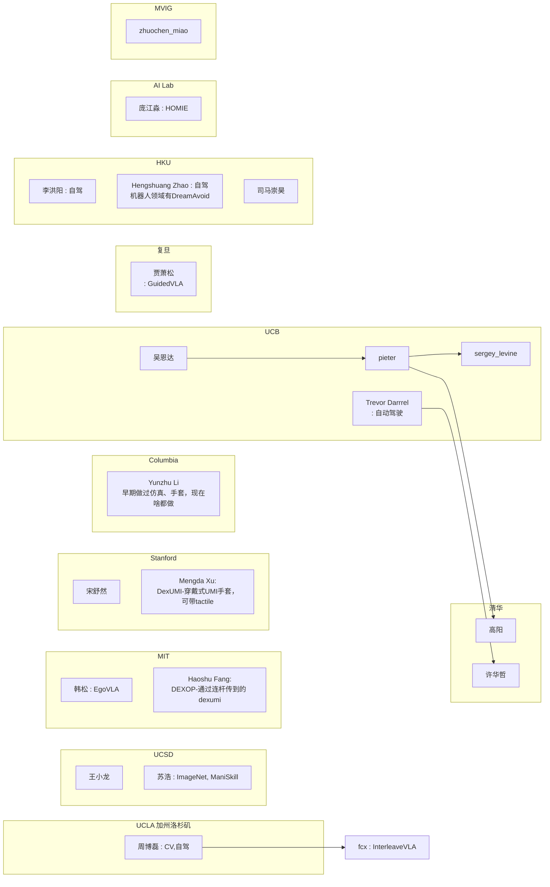
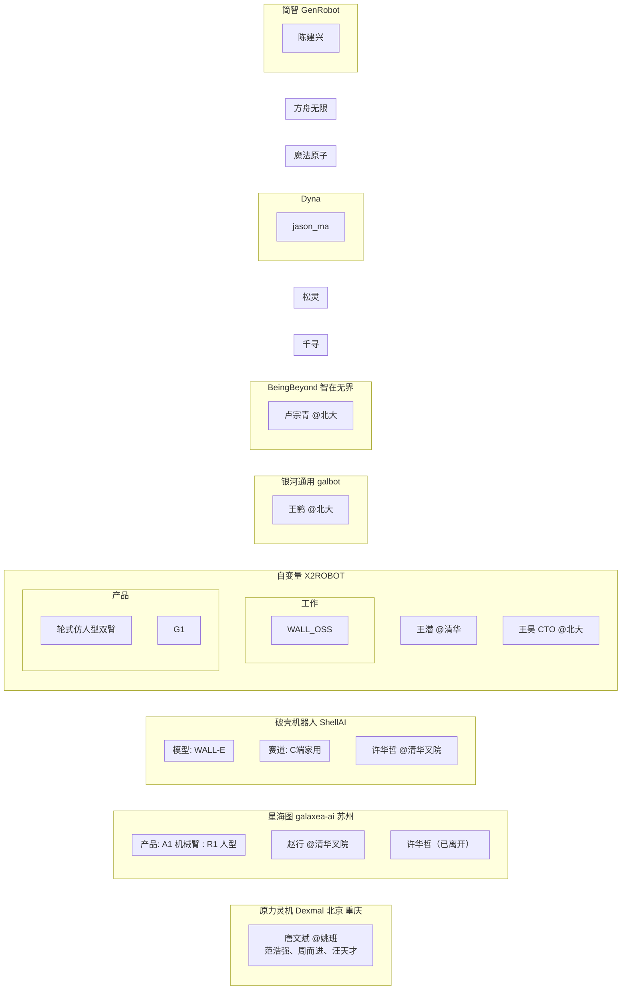

## Stanford 篇

### 核心人物

苏昊 (Hao Su)：
- 背景：本科北航，博士斯坦福（导师Leonidas J. Guibas），曾参与ImageNet。
- 贡献：参与ImageNet；发起ShapeNet；PointNet作者；推动3D视觉与具身智能；创办HillBot（2024年）。
- 关系：李飞飞学生；Leonidas学生；指导弋力、王鹤、莫凯淳等；与卢策吾合作推广具身智能。

弋力 (Li Yi)：
- 背景：斯坦福博士（导师Leonidas），2021年回国清华叉院。
- 贡献：ShapeNet核心成员；PartNet合作；推动3D部件分割与具身智能。
- 关系：苏昊师弟；与莫凯淳合作。

祁芮中台 (Charles R. Qi)：
- 背景：斯坦福博士，2019年加入Waymo，2024年加入Tesla FSD。
- 贡献：PointNet/PointNet++作者；影响自动驾驶感知。
- 关系：苏昊合作者；Leonidas学生。

卢策吾 (Cewu Lu)：
- 背景：中科院硕士、香港中文大学博士，斯坦福博后，2016年回国上海交大任教。
- 贡献：早期具身智能探索；GraspNet作者；创办非夕科技（2016年）和穹彻智能（2023年）。
- 关系：与苏昊、王世全合作；指导方浩树、李永露等学生。

王鹤 (He Wang)：
- 背景：斯坦福博士（导师Leonidas），2021年回国北大、北京智源人工智能研究院。
- 贡献：物理交互研究；GraspNeRF、DexGraspNet等；创办银河通用（2023年）。
- 关系：苏昊学生；与弋力合作。

王世全 (Shiquan Wang)：
- 背景：浙大本科、斯坦福博士（导师Mark Cutkosky、Oussama Khatib）。
- 贡献：机器人硬件专家；创办非夕科技（2016年）和穹彻智能（2023年）。
- 关系：卢策吾合作伙伴；专注“以力为中心”机器人。

黄其兴 (Qixing Huang)：
- 背景：斯坦福博士，后丰田芝加哥研究所。
- 贡献：支持ShapeNet；3D视觉研究。
- 关系：苏昊师兄；Leonidas学生。

莫凯淳 (Kaichun Mo)：
- 背景：上海交大本科、斯坦福博士，2022年加入英伟达。
- 贡献：PointNet参与；PartNet主力。
- 关系：苏昊指导学生；与弋力合作。

朱玉可 (Yuke Zhu)：
- 背景：浙大本科、斯坦福博士（导师李飞飞），2024年英伟达GEAR领导。
- 贡献：Visual Genome；早期机器人研究。
- 关系：与卢策吾合作讨论具身智能。

范麟熙 (Jim Fan)：
- 背景：斯坦福学生，2024年英伟达GEAR领导。
- 贡献：机器人研究。
- 关系：李飞飞学生；与朱玉可合作。

夏斐 (Fei Xia)：
- 背景：斯坦福博士（导师Leonidas、Silvio Savarese），后谷歌DeepMind。
- 贡献：RT-1/RT-2核心成员。
- 关系：Leonidas学生。

### 辅助人物
- 李飞飞 (Fei-Fei Li)：苏昊导师；ImageNet发起人；推动机器人与具身智能。
- Leonidas J. Guibas：斯坦福几何计算组主任；苏昊、弋力、王鹤、祁芮中台等导师。
- 沈向洋 (Harry Shum)：MSRA；苏昊导师。
- 孙剑 (Jian Sun)：MSRA视觉研究；苏昊导师。
- 吴恩达 (Andrew Ng)：苏昊实习导师；强化学习影响。
- Robert Schapire：普林斯顿教授；对视觉发展悲观。
- 顾春辉：伯克利博士；苏昊朋友。
- Manolis Savva & Angel Chang：斯坦福学生；ShapeNet合作者。
- 肖建雄 & 宋舒然：普林斯顿；ModelNet作者。
- 严梦媛、王鹤、邵林、淦创：斯坦福学生；具身智能早期参与。
- 方浩树、李永露、徐文强、王辰：卢策吾学生；具身智能本土博士。
- 陈睿、顾家远、秦誉哲、黄志翱、项帆波、刘明华、张孝帅：苏昊UCSD学生；具身智能研究。
- 陈文徵、高俊：苏昊指导；3D生成研究。
- 其他：Jitendra Malik、Pieter Abbeel、Ravi Ramamoorthi、Jeannette Bohg、Dieter Fox、张宏江、蒋树强等（导师或合作者）。

### 关键事件时间线
- 2005-2008：苏昊本科北航，导师李未；进入MSRA实习，导师沈向洋、周明、孙剑；接触AI、NLP、计算机视觉。邻座徐立、何恺明。
- 2008-2009：苏昊到普林斯顿参与ImageNet；李飞飞转斯坦福，苏昊跟随；Object Bank合作。
- 2010：苏昊在吴恩达组实习，提出端到端想法（类似AlexNet），未获支持；转向3D视觉，加入Leonidas组。
- 2012：AlexNet诞生，ImageNet推动2D视觉崛起；苏昊反思，坚定端到端前景。
- 2014：苏昊向Leonidas“推销”3D数据集想法；弋力加入；与Manolis Savva、Angel Chang合作；ShapeNet启动，第一版完成（3D数据收集、清洗）；普林斯顿ModelNet发布。
- 2015：ShapeNet第二版（加部件分割标注）；卢策吾到斯坦福博后，与朱玉可讨论机器人。
- 2016：ShapeNet完成（300万模型）；PointNet/PSGN等算法开发；卢策吾、王世全等创办非夕科技；具身智能萌芽（苏昊、卢策吾讨论机器人）；严梦媛、王鹤等加入Leonidas组；SUNC G数据集侵权事件，ShapeNet部分开放。
- 2017：PointNet/PointNet++发布（引用超1万）；苏昊到UCSD任教；3D视觉论文占比从<10%升至70%；卢策吾回上海交大，招方浩树等学生。
- 2018：苏昊斯坦福毕业；ECCV workshop“仿真环境中的视觉学习与具身智能体”（苏昊、弋力、卢策吾、黄其兴组织）；具身智能热度不高；弋力、王鹤转3D；严梦媛等转Jeannette Bohg组。
- 2019：卢策吾团队IROS两篇具身智能论文（Peg-in-hole、奖励塑造）；GraspNet发布；苏昊团队优化Sim2Real、WGAN等；SAPIEN仿真引擎发布；王鹤视觉-语言-行为模型（Eurographics最佳提名）。
- 2020：卢策吾VALSE首次谈具身智能（反应冷淡）；苏昊ManiSkill大赛；RFUniverse、BEHAVIOR、IsaacSim等仿真器发布；GraspNet全球首个AI通用抓取。
- 2021：ICCV workshop“The 1st Workshop on Simulation Technology for Embodied AI”（苏昊、王鹤、弋力组织）；弋力回清华、王鹤回北大；VALSE具身智能workshop启动；PartNet发布；DREDS传感器仿真器。
- 2022：CAAI具身智能专委会成立；VALSE具身智能workshop听众多；王鹤GraspNeRF、DexGraspNet等；莫凯淳加入英伟达。
- 2023：谷歌RT-1发布（“GPT-3时刻”）；具身智能大火；王鹤创办银河通用（Galbot G1，纯仿真95%成功率）；卢策吾创办穹彻智能；Open X Embodiment数据集（上海交大参与）；VALSE具身智能workshop火爆。
- 2024：苏昊创办HillBot（CTO）；祁芮中台加入Tesla；VALSE具身智能tutorial（王鹤主讲）；朱玉可、Jim Fan领导英伟达GEAR。

# markdown li

感觉 mermaid 还是不太行，来个 markdown li + 自然叙述
- Fang 方浩树: 卢老板学生，MIT 博士后。代表作 GraspNet.
- Jason Ma: 马也骋，Dyna
- Ren 任至意: 又称 Allen Ren，做 Pi 的预训练
- Su 苏航: 交大毕业，现在清华.
- Su 苏昊: 本科北航，博士斯坦福. 参与 ImageNet.
- Wang 王尊玄: Genesis
- Xu 徐丹飞: 佐治亚理工，同时在 NVIDIA. EgoMimic 通讯作者，参与 OXE. 他比较相信 Ego.
- Yao 姚卯青: 智元合伙人，觅蜂科技 CEO.
- Yi 弋力：

企业
- 大咖机器人：文强哥
- Dyna：CEO 为 Jason Ma. 总部在硅谷，分部在上海长宁区.

# mermaid

articles:
- https://zhuanlan.zhihu.com/p/655943844
- https://zhuanlan.zhihu.com/p/1942577585402909352

archive commit: 0cdea62fe9eb778ef183587c52e3e89ae4d7514b

博客：
- 在我们组里工作过的 selen: https://selen-suyue.github.io/biosite/archives/