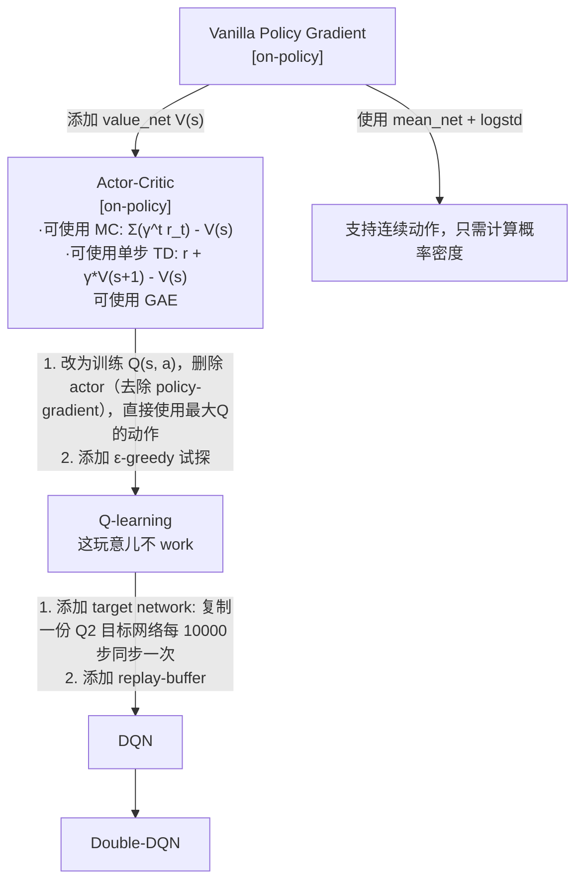

```mermaid
flowchart TD
    PG["Vanilla Policy Gradient<br>[on-policy]"] -->|"添加 value_net V(s)"| AC
    AC["Actor-Critic<br>[on-policy]<br>·可使用 MC: Σ(γ^t r_t) - V(s)<br>·可使用单步 TD: r + γ*V(s+1) - V(s)<br>可使用 GAE"]
    PG -->|使用 mean_net + logstd| cont[支持连续动作，只需计算概率密度]
    AC -->|"1. 改为训练 Q(s, a)，删除 actor（去除 policy-gradient），直接使用最大Q的动作<br>2. 添加 ε-greedy 试探"| Q-learning["Q-learning<br>这玩意儿不 work"]
    Q-learning -->|"1. 添加 target network: 复制一份 Q2 目标网络每 10000 步同步一次<br>2. 添加 replay-buffer"| DQN
    DQN --> Double-DQN
```
