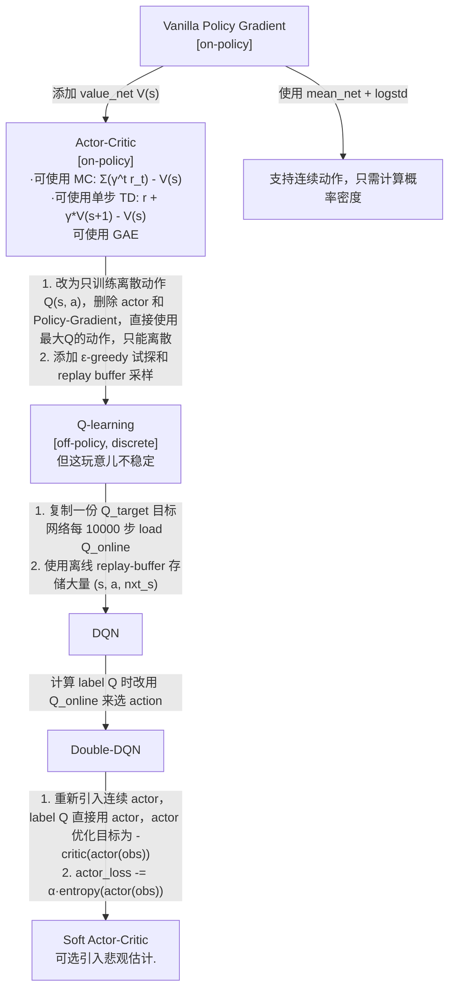

```mermaid
flowchart TD
    PG["Vanilla Policy Gradient<br>[on-policy]"] -->|"添加 value_net V(s)"| AC
    AC["Actor-Critic<br>[on-policy]<br>·可使用 MC: Σ(γ^t r_t) - V(s)<br>·可使用单步 TD: r + γ*V(s+1) - V(s)<br>可使用 GAE"]
    PG -->|使用 mean_net + logstd| cont[支持连续动作，只需计算概率密度]
    AC -->|"1. 改为只训练离散动作 Q(s, a)，删除 actor 和 Policy-Gradient，直接使用最大Q的动作，只能离散<br>2. 添加 ε-greedy 试探和 replay buffer 采样"| Q-learning["Q-learning<br>[off-policy, discrete]<br>但这玩意儿不稳定"]
    Q-learning -->|"1. 复制一份 Q_target 目标网络每 10000 步 load Q_online<br>2. 使用离线 replay-buffer 存储大量 (s, a, nxt_s)"| DQN
    DQN -->|"计算 label Q 时改用 Q_online 来选 action"| Double-DQN
    Double-DQN -->|"1. 重新引入连续 actor，label Q 直接用 actor，actor 优化目标为 -critic(actor(obs))<br>2. actor_loss -= α·entropy(actor(obs))"| SAC["Soft Actor-Critic<br>可选引入悲观估计."]
```

## Utils
1. https://rail.eecs.berkeley.edu/deeprlcourse/
