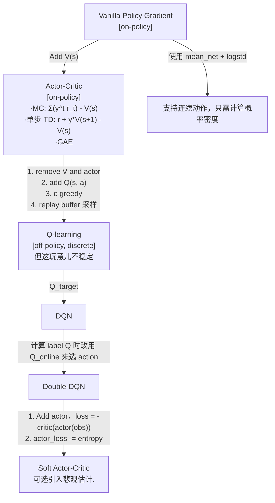

## Utils
1. https://rail.eecs.berkeley.edu/deeprlcourse/

## 伪代码
1. 以下的 loss 省略 mean().
2. critic 指的是 Q(s, a)，不是指 V(s).

### PG: on-policy, 离散和连续动作均可
```python
s, a, r, nxt_s, done = rollout()
actor_loss = -actor(s).log_prob(a) * reward_to_go(r)
#             |<---------------->|
#      Gradient increases prob of good actions.
```

### AC: on-policy
好处：降低优势方差.
```python
s, a, r, nxt_s, done = rollout()
v_loss = mse(
    value_net(s),
    reward_to_go(r)
)

actor_loss = -actor(s).log_prob(a) * (reward_to_go(r) - value_net(s).detach())
```

### Double-DQN: off-policy, discrete-only
好处：off-policy 大幅提升 sample efficiency.
```python
s, a, r, nxt_s, done = replaybuffer.sample()
critic_loss = mse(
    online_critic(s, a),
    [no grad] r + gamma * target_critic(nxt_s)[argmax_a online_critic(nxt_s, all a) * (1 - done)])
)
```

其中离散 critic: `s -> value[b, num_actions]` 输出所有 action 的价值.

### SAC: off-policy
好处：支持连续动作.
```python
s, a, r, nxt_s, done = replaybuffer.sample()
critic_loss = mse(
    online_critic(s, a),
    [no_grad] r + gamma * target_critic(nxt_s, actor(nxt_s).sample()) * (1 - done)
    #                                          |<-------->|
    #                                       this is a distribution
)
actor_loss = -online_critic(actor(s).rsample()) - entropy(actor(s)) * temperature
```

- 其中连续 critic: `s, a -> value[b,]`，输出给定 action 价值
- 连续 actor: `s -> a[b, action_dim][dtype=Distribution]`

### Implicit Q-learning: offline
1. 有 Q, V, actor.
2. 好处：在仅有静态数据集的情况下，SAC 的 actor(s).rsample() 可能产生远离静态数据集的数据，会被 argmax 或者 multi-critic max 放大.

```python
s, a, r, nxt_s, done = replaybuffer.sample()
diff = target_critic(s, a).detach() - value_net(s)
v_loss = mse(
    where(diff > 0, 0.7, 0.3) * diff,
    0
)

critic_loss = mse(
    online_critic(s, a),
    [no_grad] r + gamma * value_net(nxt_s) * (1 - done)
)

exp_advantage = (target_critic(s, a) - value_net(s)).exp().clamp(100)
actor_loss = -(exp_advantage * actor(s).log_prob(a))
```
